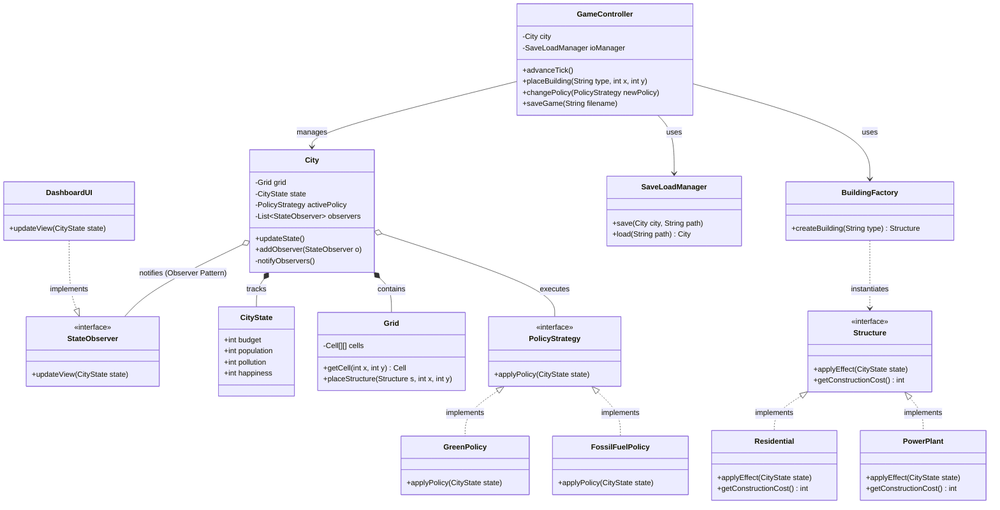

Architettura MVC e Pattern Observer: Abbiamo separato strettamente la UI (DashboardUI) dalla logica.
La UI implementa l'interfaccia StateObserver. La classe City non sa nulla dell'interfaccia grafica: quando il suo stato cambia, si limita a chiamare notifyObservers().
Questo garantisce un Basso Accoppiamento (Low Coupling).Gestione dei Dati (File I/O): 
Come richiesto, abbiamo evitato i Database. Abbiamo applicato il principio di Alta Coesione (High Cohesion) creando una classe dedicata SaveLoadManager (che userà Jackson o Gson) , 
impedendo così alla classe City di violare il suo ruolo diventando una God Class che gestisce sia la simulazione che il File System .Pattern GoF Fondamentali: L'uso della BuildingFactory e della PolicyStrategy  assicura che il sistema sia estensibile (Open-Closed Principle): 
potremo aggiungere nuovi edifici o nuove politiche senza dover toccare il codice del motore principale.