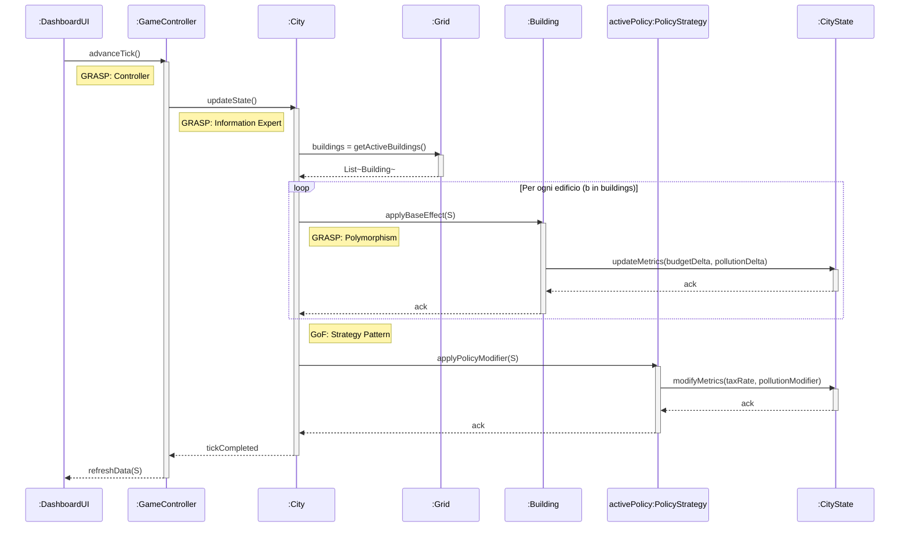
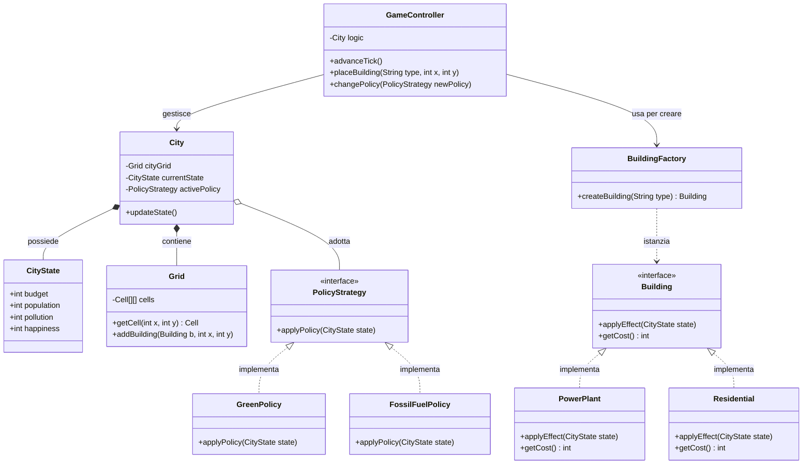

GRASP - Controller: Il messaggio iniziale advanceTick() parte dalla DashboardUI (livello di presentazione) e viene ricevuto dal GameController. Il Controller agisce come intermediario, disaccoppiando l'interfaccia grafica dalla logica di dominio (Low Coupling). Non esegue i calcoli, ma delega l'operazione.

GRASP - Information Expert: Il GameController delega l'aggiornamento alla classe City invocando updateState(). La classe City è l'Esperto dell'Informazione per questa operazione, poiché possiede i riferimenti alla Grid (dove si trovano gli edifici), allo stato globale CityState e all'ordinanza attiva PolicyStrategy.

GRASP - Polymorphism: Nel ciclo loop, la classe City invoca applyBaseEffect(S) sull'interfaccia/classe astratta Building. Il sistema usa il polimorfismo per calcolare gli effetti: la classe City non ha bisogno di sapere se sta parlando con una centrale elettrica o una zona residenziale (non ci sono costrutti switch o if-else). Ogni specifica sottoclasse di Building sa come aggiornare le proprie metriche.

GoF - Strategy Pattern: Dopo aver calcolato gli effetti base di tutti gli edifici, la City delega il calcolo delle tasse o delle riduzioni dell'inquinamento all'oggetto activePolicy (istanza dell'interfaccia PolicyStrategy). La City è il Context del pattern: non conosce l'algoritmo specifico della politica attiva (es. Tassa Ambientale vs Espansione Industriale), ma invoca semplicemente applyPolicyModifier(S). Questo garantisce un design aperto all'estensione ma chiuso alla modifica (Open-Closed Principle).