# Documento di Design — CityLogic City Simulator

**Versione:** 2.0 (Aggiornata con i nuovi diagrammi dettagliati)

---

## 1. Domain Model

Il dominio di CityLogic ruota attorno alla classe `City`, che orchestra tutti i sottosistemi della simulazione. La `City` possiede una `Grid` 20x20 di celle (`Cell`), ognuna delle quali può contenere al massimo una struttura (`Structure`). Lo stato globale della città è raccolto in `CityState`.

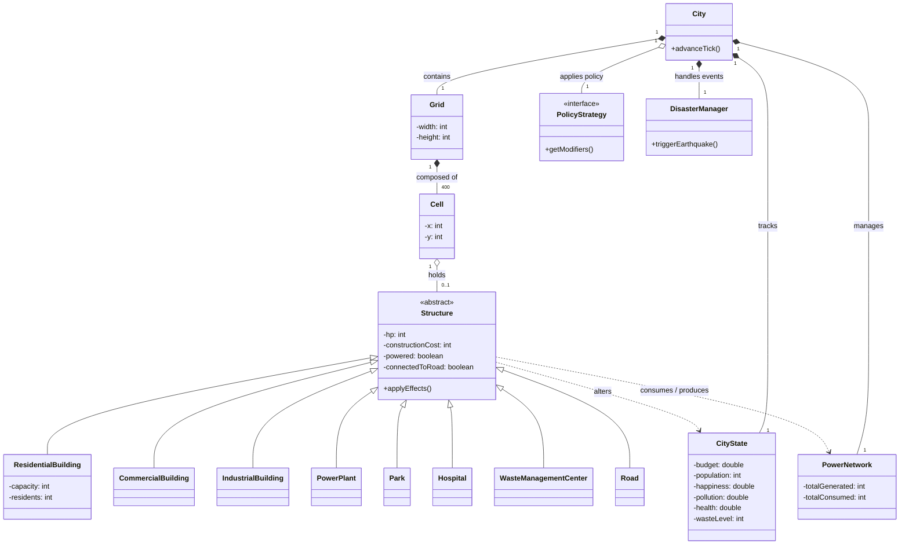

---

## 2. System Sequence Diagrams

I diagrammi seguenti mostra le interazioni tra l'attore esterno (Player) e il Sistema senza classi interne.

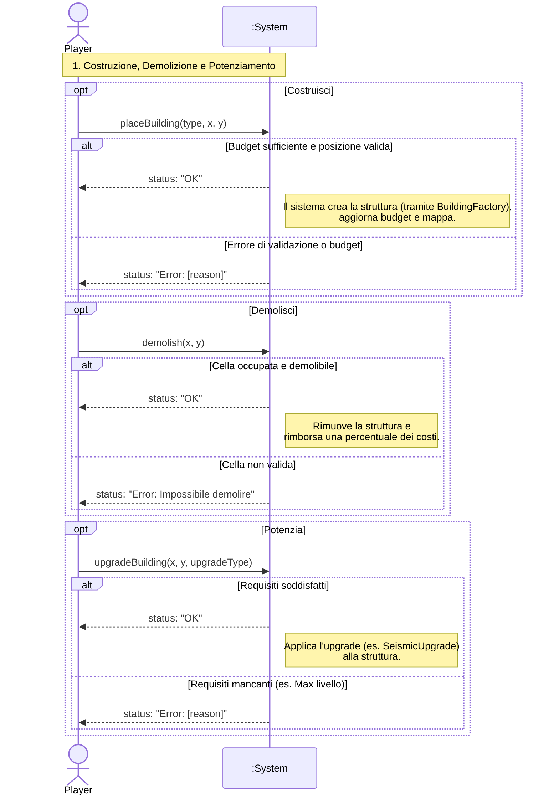

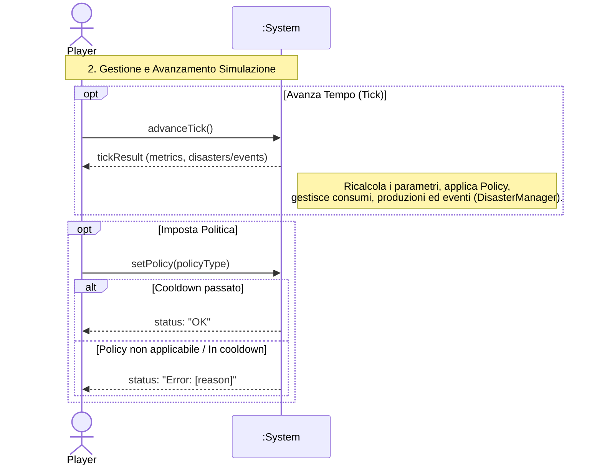

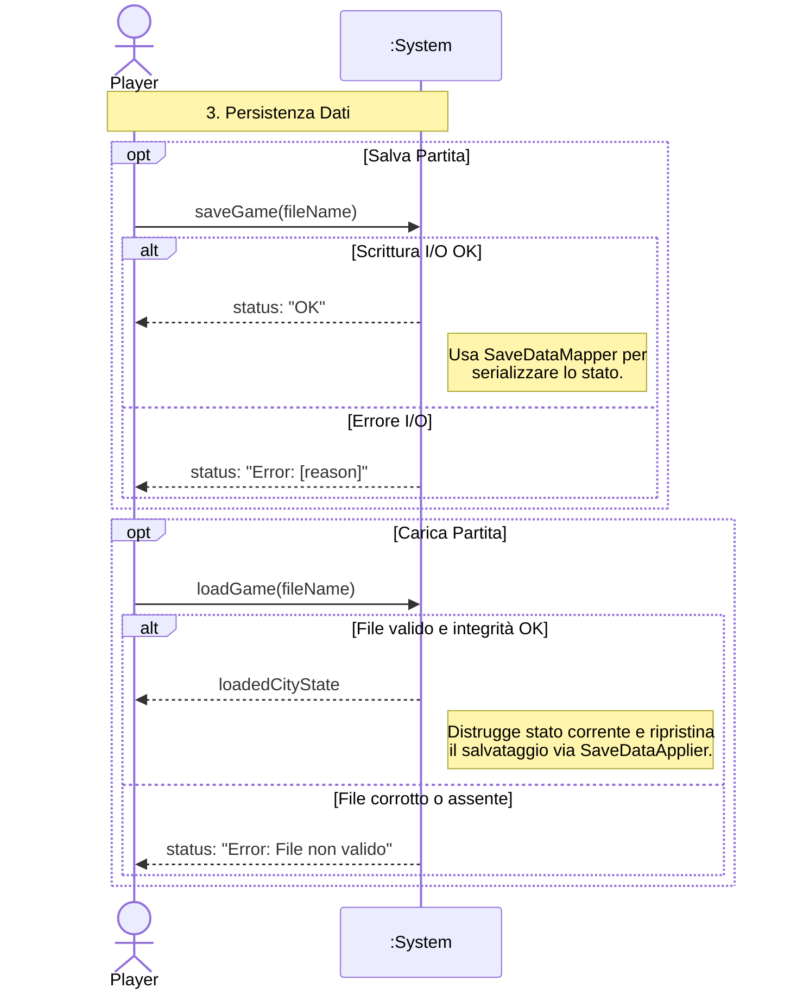

---

## 3. Design Class Model

Il modello di design riflette la struttura tecnica completa, inclusi i layer di controllo. Per rendere più agevole la consultazione e il rendering in Mermaid, questo sistema complesso è stato **suddiviso in tre moduli separati**. I pattern architetturali e di design chiave implementati e visibili in questi diagrammi sono:

- **Facade** *(Modulo 1)* — `SimulationController` è un wrapper leggero attorno a `GameController`; la UI non tocca mai il dominio direttamente.
- **GRASP Controller** *(Modulo 1)* — `GameController` è l'unico punto di ingresso per le operazioni che mutano lo stato (place, demolish, repair, repairAll, upgrade, policy change, save/load).
- **Strategy** *(Modulo 3)* — `PolicyStrategy` con 4 implementazioni; `CityState.resolveTick(PolicyModifiers)` applica i modificatori senza conoscere la policy concreta.
- **Observer** *(Modulo 3)* — `City` notifica gli `StateObserver` (la UI) ad ogni tick; `DisasterManager` notifica i `DisasterObserver` (le strutture) ad ogni terremoto.
- **Decorator** *(Modulo 2)* — `StructureDecorator` avvolge `Structure` per aggiungere comportamento (dimezzamento danni, recupero termico) senza modificare le classi base.
- **Factory** *(Modulo 2)* — `BuildingFactory` centralizza la costruzione di tutte le istanze `Structure` e la riapplicazione degli upgrade al caricamento del salvataggio.
- **Template Method** *(Modulo 2)* — `Structure` definisce lo scheletro del ciclo di vita (decayTick, applyEffects, takeDamage); ogni sottoclasse sovrascrive solo `applyEffects()` e `getType()`.

### 3.1 Architettura Core (Controller e Mondo)

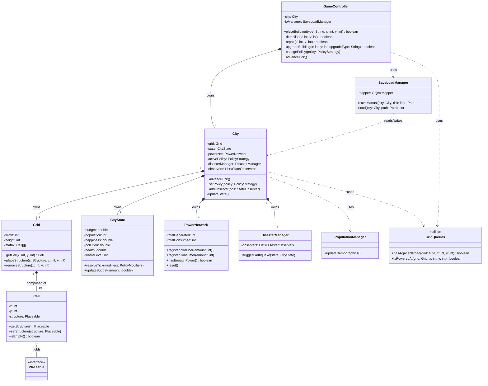

### 3.2 Strutture e Gerarchia degli Edifici (Template Method & Decorator)

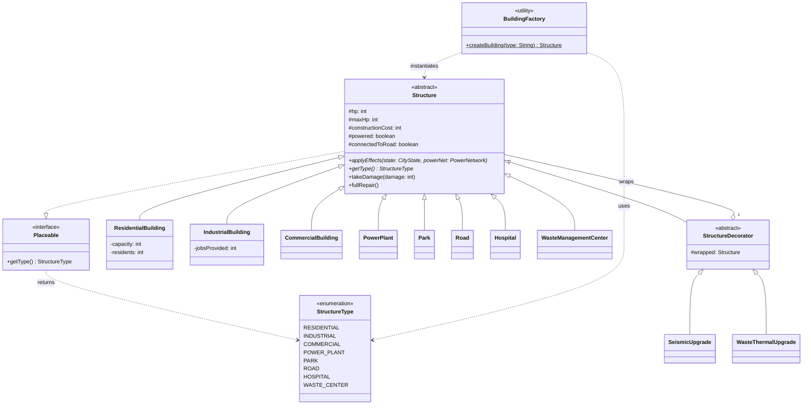

### 3.3 Politiche Economiche e Observer Pattern

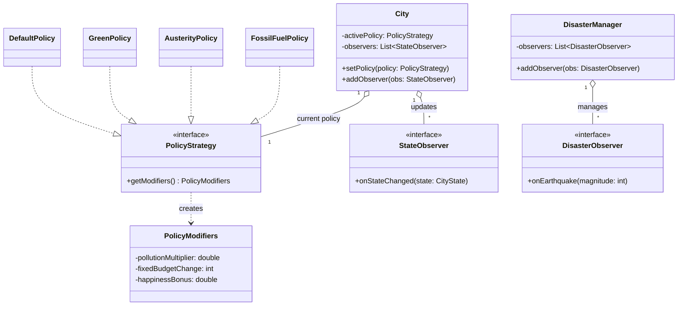

### 3.4 Livello UI (User Interface e JavaFX)

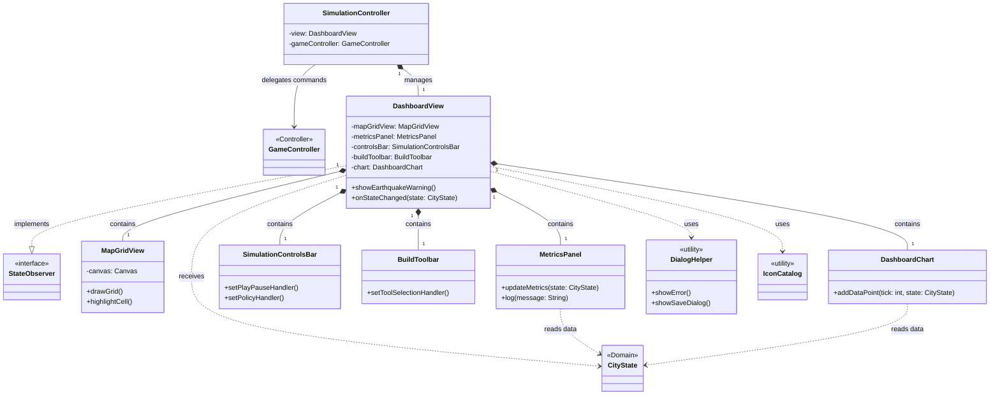

---

## 4. Internal Sequence Diagrams

I diagrammi interni documentano le interazioni tra i componenti del dominio per le operazioni più significative, annotando i pattern GRASP e GoF applicati.

### 4.1 advanceTick() — Flusso tick completo

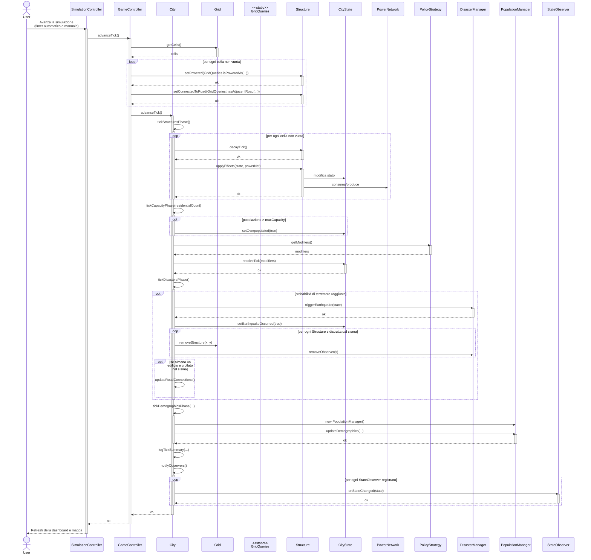

### 4.2 placeBuilding(type, x, y)

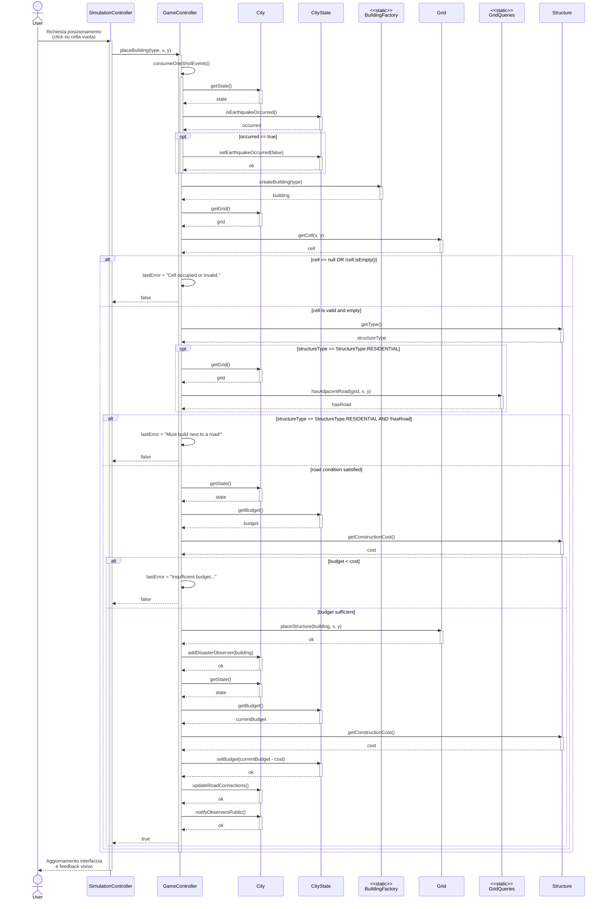

### 4.3 changePolicy(policy)

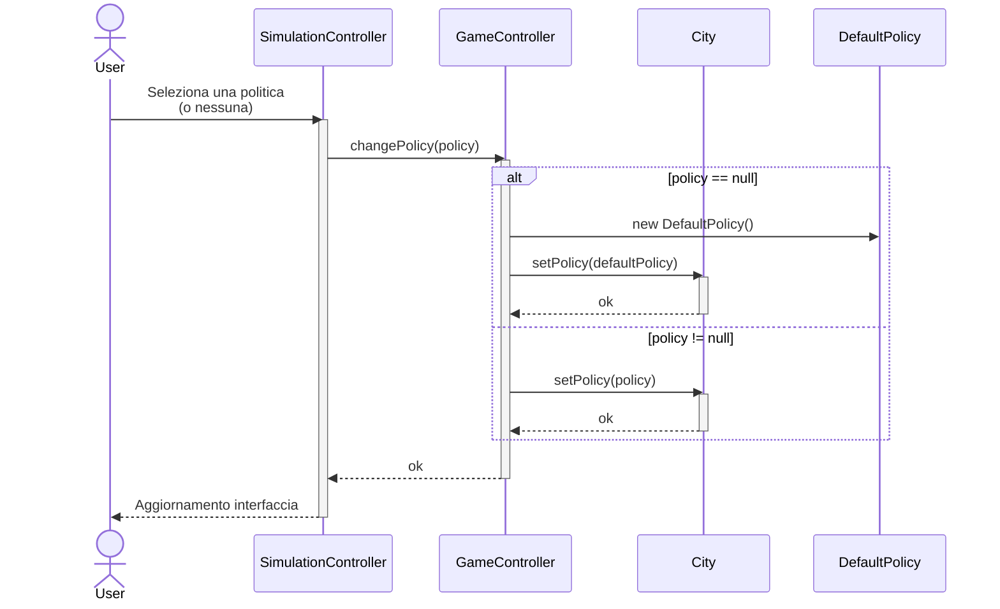

### 4.4 saveManualGame(tick)

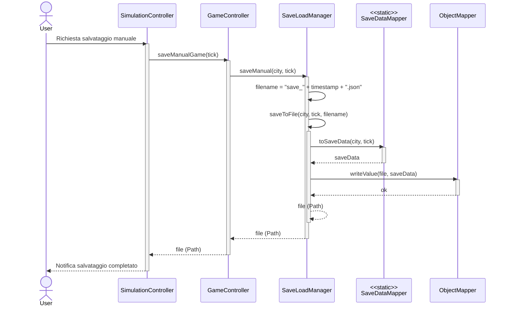

### 4.5 loadGame(path)

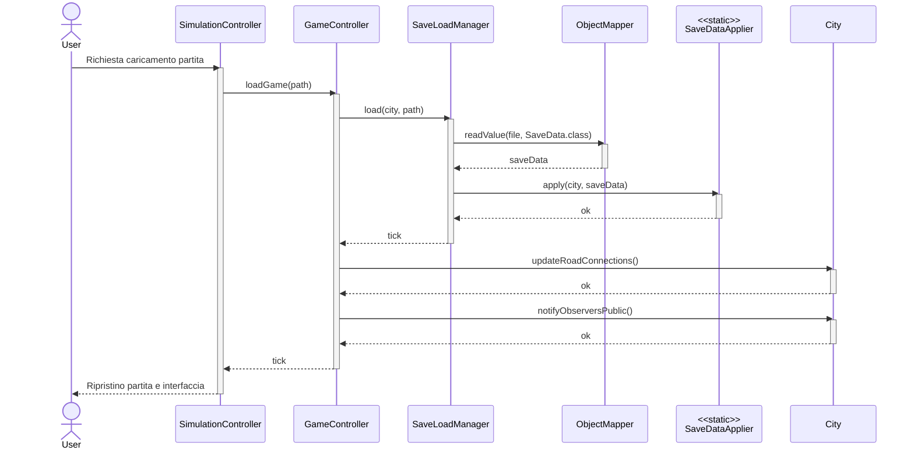
