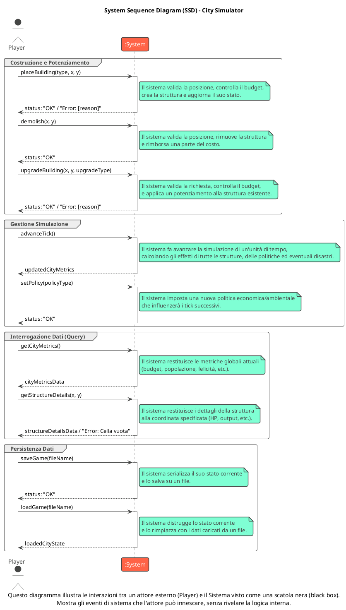
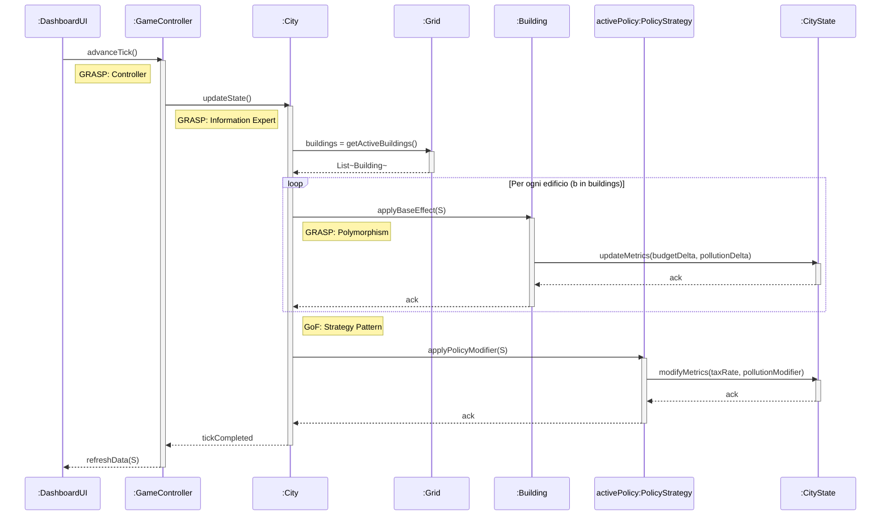
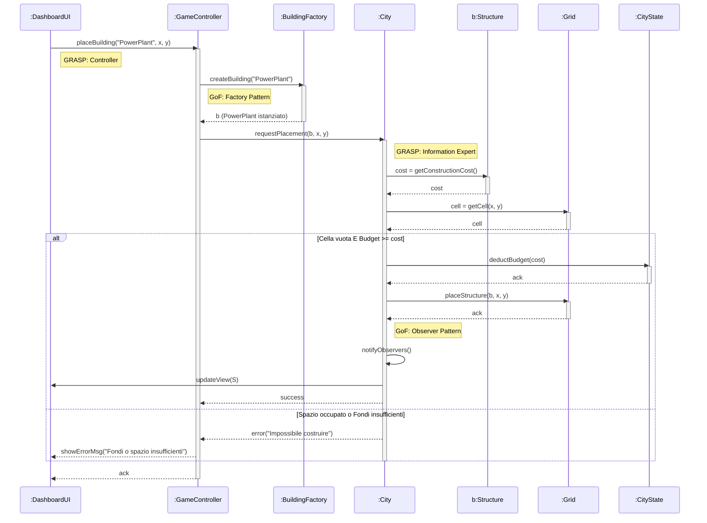
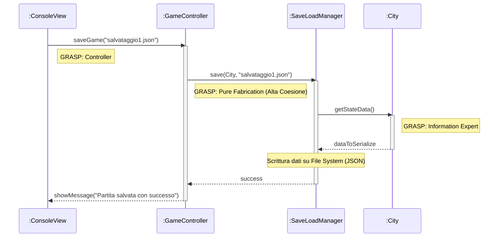

# Documento di Design — CityLogic City Simulator

**Versione:** 1.0 — 2026-05-18

---

## 1. Domain Model

Il dominio di CityLogic ruota attorno alla classe `City`, che orchestra tutti i sottosistemi della simulazione. La `City` possiede una `Grid` 20×20 di celle (`Cell`), ognuna delle quali può contenere al massimo una struttura (`Structure`). Lo stato globale della città — budget, popolazione, happiness, health, pollution, waste — è raccolto in `CityState`, che accumula i delta prodotti dagli edifici ad ogni tick e li risolve applicando i modificatori della `PolicyStrategy` attiva.

Le strutture concrete (8 tipi: `ResidentialBuilding`, `IndustrialBuilding`, `CommercialBuilding`, `PowerPlant`, `Park`, `Road`, `Hospital`, `WasteManagementCenter`) ereditano da `Structure` (classe astratta) e implementano `applyEffects()` secondo il **Template Method Pattern**. I potenziamenti (`SeismicUpgrade`, `WasteThermalUpgrade`) avvolgono le strutture con il **Decorator Pattern** senza modificarne il codice sorgente.

La `PowerNetwork` tiene traccia del bilancio energetico produzione/consumo. Il `DisasterManager` gestisce i terremoti con probabilità 1%/tick, notificando tutte le strutture registrate tramite il **Observer Pattern** (`DisasterObserver`). Le politiche cittadine (Default, Green, FossilFuel, Austerity) implementano la `PolicyStrategy` (**Strategy Pattern**) e alterano i moltiplicatori di `CityState.resolveTick()`. Il `SaveLoadManager` serializza e deserializza lo stato completo in JSON tramite Jackson (**Pure Fabrication**).

```mermaid
classDiagram
    direction TB

    %% ==========================================
    %% INTERFACES
    %% ==========================================
    class Placeable {
        <<interface>>
        +getType() StructureType
    }
    class PolicyStrategy {
        <<interface>>
        +getModifiers() PolicyModifiers
    }
    class StateObserver {
        <<interface>>
        +onStateChanged(state: CityState)
    }
    class DisasterObserver {
        <<interface>>
        +onEarthquake(magnitude: int)
    }

    %% ==========================================
    %% ENUMERATIONS
    %% ==========================================
    class StructureType {
        <<enumeration>>
        RESIDENTIAL
        INDUSTRIAL
        COMMERCIAL
        POWER_PLANT
        PARK
        ROAD
        HOSPITAL
        WASTE_CENTER
    }

    %% ==========================================
    %% CORE DOMAIN CLASSES
    %% ==========================================
    class City {
        -grid: Grid
        -state: CityState
        -powerNet: PowerNetwork
        -activePolicy: PolicyStrategy
        -disasterManager: DisasterManager
        -observers: List~StateObserver~
        +advanceTick()
        +setPolicy(policy: PolicyStrategy)
        +addObserver(obs: StateObserver)
        -notifyObservers()
    }

    class GameController {
        -city: City
        +placeBuilding(type: String, x: int, y: int) boolean
        +demolish(x: int, y: int) boolean
        +advanceTick()
    }

    class Grid {
        -width: int
        -height: int
        -matrix: Cell[][]
        +getCell(x: int, y: int) Cell
    }

    class Cell {
        -x: int
        -y: int
        -structure: Placeable
        +getStructure() Placeable
        +isEmpty() boolean
    }

    class CityState {
        -budget: double
        -population: int
        -happiness: double
        -pollution: double
        +resolveTick(modifiers: PolicyModifiers)
        +updateBudget(amount: double)
        +getBudget() double
    }

    class PowerNetwork {
        -totalGenerated: int
        -totalConsumed: int
        +registerProducer(amount: int)
        +registerConsumer(amount: int)
        +hasSufficientPower() boolean
    }

    class SaveLoadManager {
        +saveGame(city: City, path: String) boolean
        +loadGame(path: String) City
    }

    %% ==========================================
    %% STRUCTURES (TEMPLATE METHOD PATTERN)
    %% ==========================================
    class Structure {
        <<abstract>>
        #hp: int
        #maxHp: int
        #constructionCost: double
        +applyEffects(state: CityState, powerNet: PowerNetwork)*
        +getType() StructureType*
        +takeDamage(damage: int)
        +repair()
        +isDestroyed() boolean
    }

    class ResidentialBuilding { +applyEffects() +getType() StructureType }
    class IndustrialBuilding  { +applyEffects() +getType() StructureType }
    class CommercialBuilding  { +applyEffects() +getType() StructureType }
    class PowerPlant          { +applyEffects() +getType() StructureType }
    class Park                { +applyEffects() +getType() StructureType }
    class Road                { +applyEffects() +getType() StructureType }
    class Hospital            { +applyEffects() +getType() StructureType }
    class WasteManagementCenter { +applyEffects() +getType() StructureType }

    %% ==========================================
    %% DECORATORS (DECORATOR PATTERN)
    %% ==========================================
    class StructureDecorator {
        <<abstract>>
        #wrapped: Structure
        +applyEffects()
        +takeDamage(damage: int)
    }
    class SeismicUpgrade       { +takeDamage(damage: int) }
    class WasteThermalUpgrade  { +applyEffects() }

    %% ==========================================
    %% POLICIES (STRATEGY PATTERN)
    %% ==========================================
    class PolicyModifiers {
        -pollutionMultiplier: double
        -fixedBudgetChange: int
        -happinessBonus: double
    }
    class DefaultPolicy    { +getModifiers() PolicyModifiers }
    class GreenPolicy      { +getModifiers() PolicyModifiers }
    class AusterityPolicy  { +getModifiers() PolicyModifiers }
    class FossilFuelPolicy { +getModifiers() PolicyModifiers }

    %% ==========================================
    %% FACTORY
    %% ==========================================
    class BuildingFactory {
        <<utility>>
        +createBuilding(type: String)$ Structure
        +applyUpgrade(base: Structure, upgradeType: String)$ Structure
    }

    %% ==========================================
    %% DISASTER MANAGEMENT (OBSERVER)
    %% ==========================================
    class DisasterManager {
        -observers: List~DisasterObserver~
        +addObserver(obs: DisasterObserver)
        +removeObserver(obs: DisasterObserver)
        +triggerEarthquake(state: CityState)
    }

    %% ==========================================
    %% RELATIONSHIPS
    %% ==========================================
    GameController "1" o-- "1" City : controls
    City "1" o-- "1" Grid : contains
    City "1" o-- "1" CityState : tracks
    City "1" o-- "1" PowerNetwork : manages
    City "1" o-- "1" DisasterManager : uses
    City "1" o-- "1" PolicyStrategy : applies
    Grid "1" *-- "0..*" Cell : composed of
    Cell "1" o-- "0..1" Placeable : holds

    Placeable <|.. Structure
    DisasterObserver <|.. Structure

    Structure <|-- ResidentialBuilding
    Structure <|-- IndustrialBuilding
    Structure <|-- CommercialBuilding
    Structure <|-- PowerPlant
    Structure <|-- Park
    Structure <|-- Road
    Structure <|-- Hospital
    Structure <|-- WasteManagementCenter

    Structure <|-- StructureDecorator
    StructureDecorator "1" o-- "1" Structure : wraps
    StructureDecorator <|-- SeismicUpgrade
    StructureDecorator <|-- WasteThermalUpgrade

    PolicyStrategy <|.. DefaultPolicy
    PolicyStrategy <|.. GreenPolicy
    PolicyStrategy <|.. AusterityPolicy
    PolicyStrategy <|.. FossilFuelPolicy

    CityState ..> PolicyModifiers : uses
    PolicyStrategy ..> PolicyModifiers : creates
    GameController ..> BuildingFactory : uses
    SaveLoadManager ..> BuildingFactory : uses
    City ..> StateObserver : notifies
    DisasterManager ..> DisasterObserver : notifies
```

---

## 2. System Sequence Diagrams

Il diagramma seguente mostra le interazioni tra l'attore esterno (Player) e il Sistema visto come scatola nera. Documenta le 4 categorie di operazioni disponibili: costruzione/potenziamento, gestione simulazione, interrogazione dati e persistenza.

---

## 3. Design Class Model

Il modello di design riflette la struttura tecnica del package di dominio. I pattern architetturali chiave sono:

- **Facade** — `SimulationController` è un wrapper leggero attorno a `GameController`; la UI non tocca mai il dominio direttamente.
- **GRASP Controller** — `GameController` è l'unico punto di ingresso per le operazioni che mutano lo stato (place, demolish, repair, upgrade, policy change, save/load).
- **Strategy** — `PolicyStrategy` con 4 implementazioni; `CityState.resolveTick(PolicyModifiers)` applica i modificatori senza conoscere la policy concreta.
- **Observer** — `City` notifica `StateObserver` (la UI) ad ogni tick; `DisasterManager` notifica `DisasterObserver` (le strutture) ad ogni terremoto.
- **Decorator** — `StructureDecorator` avvolge `Structure` per aggiungere comportamento (dimezzamento danni, recupero termico) senza modificare le classi base.
- **Factory** — `BuildingFactory` centralizza la costruzione di tutte le istanze `Structure` e l'applicazione degli upgrade; evita `new` sparsi nel codice.
- **Template Method** — `Structure` definisce lo scheletro del ciclo di vita (decayTick, applyEffects, takeDamage); ogni sottoclasse sovrascrive solo `applyEffects()` e `getType()`.

```mermaid
classDiagram
    direction TB

    %% --- ENUMS ---
    class StructureType {
        <<enumeration>>
        RESIDENTIAL
        INDUSTRIAL
        COMMERCIAL
        POWER_PLANT
        PARK
        ROAD
        HOSPITAL
        WASTE_CENTER
    }

    %% --- INTERFACES ---
    class Placeable {
        <<interface>>
        +getType() StructureType
    }
    class PolicyStrategy {
        <<interface>>
        +getModifiers() PolicyModifiers
    }
    class StateObserver {
        <<interface>>
        +onStateChanged(state: CityState)
    }
    class DisasterObserver {
        <<interface>>
        +onEarthquake(magnitude: int)
    }

    %% --- CORE ---
    class GameController {
        -city: City
        +placeBuilding(type: String, x: int, y: int)
        +demolish(x: int, y: int)
        +advanceTick()
    }

    class City {
        -grid: Grid
        -state: CityState
        -powerNet: PowerNetwork
        -activePolicy: PolicyStrategy
        -disasterManager: DisasterManager
        -observers: List~StateObserver~
        +advanceTick()
        +setPolicy(policy: PolicyStrategy)
        +addObserver(observer: StateObserver)
        -notifyObservers()
    }

    class Grid {
        -matrix: Cell[][]
        +getCell(x: int, y: int) Cell
    }

    class Cell {
        -structure: Placeable
        +getStructure() Placeable
        +setStructure(structure: Placeable)
        +isEmpty() boolean
    }

    class CityState {
        -budget: double
        -population: int
        -happiness: double
        -pollution: double
        +resolveTick(modifiers: PolicyModifiers)
        +updateBudget(amount: double)
        +getBudget() double
    }

    class PowerNetwork {
        -totalGenerated: int
        -totalConsumed: int
        +registerProducer(amount: int)
        +registerConsumer(amount: int)
        +hasSufficientPower() boolean
    }

    class DisasterManager {
        -observers: List~DisasterObserver~
        +addObserver(observer: DisasterObserver)
        +removeObserver(observer: DisasterObserver)
        +triggerEarthquake(state: CityState)
    }

    class SaveLoadManager {
        +saveGame(city: City, path: String) boolean
        +loadGame(path: String) City
    }

    %% --- STRUCTURES (Template Method) ---
    class Structure {
        <<abstract>>
        #hp: int
        #maxHp: int
        +applyEffects(state: CityState, powerNet: PowerNetwork)*
        +getType() StructureType*
        +takeDamage(amount: int)
    }
    class ResidentialBuilding
    class IndustrialBuilding
    class CommercialBuilding
    class PowerPlant
    class Park
    class Road
    class Hospital
    class WasteManagementCenter

    %% --- DECORATORS ---
    class StructureDecorator {
        <<abstract>>
        #wrapped: Structure
    }
    class SeismicUpgrade
    class WasteThermalUpgrade

    %% --- STRATEGIES (Policies) ---
    class PolicyModifiers {
        -pollutionMultiplier: double
        -fixedBudgetChange: int
    }
    class DefaultPolicy
    class GreenPolicy
    class AusterityPolicy
    class FossilFuelPolicy

    %% --- FACTORY ---
    class BuildingFactory {
        +createBuilding(type: String)$ Structure
        +applyUpgrade(base: Structure, upgradeType: String)$ Structure
    }

    %% --- RELATIONSHIPS ---
    Structure ..|> Placeable
    Structure ..|> DisasterObserver

    GameController "1" o-- "1" City : controls
    City "1" o-- "1" Grid : contains
    City "1" o-- "1" CityState : tracks
    City "1" o-- "1" PowerNetwork : manages
    City "1" o-- "1" DisasterManager : uses
    City "1" o-- "1" PolicyStrategy : applies

    Grid "1" *-- "*" Cell : composed of
    Cell "1" o-- "0..1" Placeable : holds

    ResidentialBuilding --|> Structure
    IndustrialBuilding --|> Structure
    CommercialBuilding --|> Structure
    PowerPlant --|> Structure
    Park --|> Structure
    Road --|> Structure
    Hospital --|> Structure
    WasteManagementCenter --|> Structure

    StructureDecorator --|> Structure
    StructureDecorator "1" o-- "1" Structure : wraps
    SeismicUpgrade --|> StructureDecorator
    WasteThermalUpgrade --|> StructureDecorator

    DefaultPolicy ..|> PolicyStrategy
    GreenPolicy ..|> PolicyStrategy
    AusterityPolicy ..|> PolicyStrategy
    FossilFuelPolicy ..|> PolicyStrategy

    CityState ..> PolicyModifiers : uses
    PolicyStrategy ..> PolicyModifiers : creates

    GameController ..> BuildingFactory : uses
    SaveLoadManager ..> BuildingFactory : uses

    City "1" o-- "*" StateObserver : notifies
    Placeable ..> StructureType : returns
    Structure ..> StructureType : returns
```

---

## 4. Internal Sequence Diagrams

I tre diagrammi interni documentano le interazioni tra i componenti del dominio per le operazioni più significative, annotando i pattern GRASP e GoF applicati.

### 4.1 advanceTick()

Il flusso principale della simulazione: la UI delega al `GameController` (GRASP Controller), che delega a `City` (Information Expert). `City` itera sugli edifici applicando gli effetti via polimorfismo (GRASP Polymorphism), poi applica i modificatori della policy attiva (GoF Strategy).

### 4.2 placeBuilding("PowerPlant", x, y)

Il `GameController` riceve la richiesta dalla UI, usa `BuildingFactory` per istanziare la struttura (GoF Factory), poi delega la validazione e il piazzamento a `City` (Information Expert). In caso di successo, `City` notifica gli observer (GoF Observer).

### 4.3 saveGame()

Il `GameController` delega il salvataggio al `SaveLoadManager` (GRASP Pure Fabrication — classe creata per gestire la responsabilità I/O senza inquinare il dominio). `SaveLoadManager` interroga `City` per i dati (Information Expert) e serializza in JSON.

