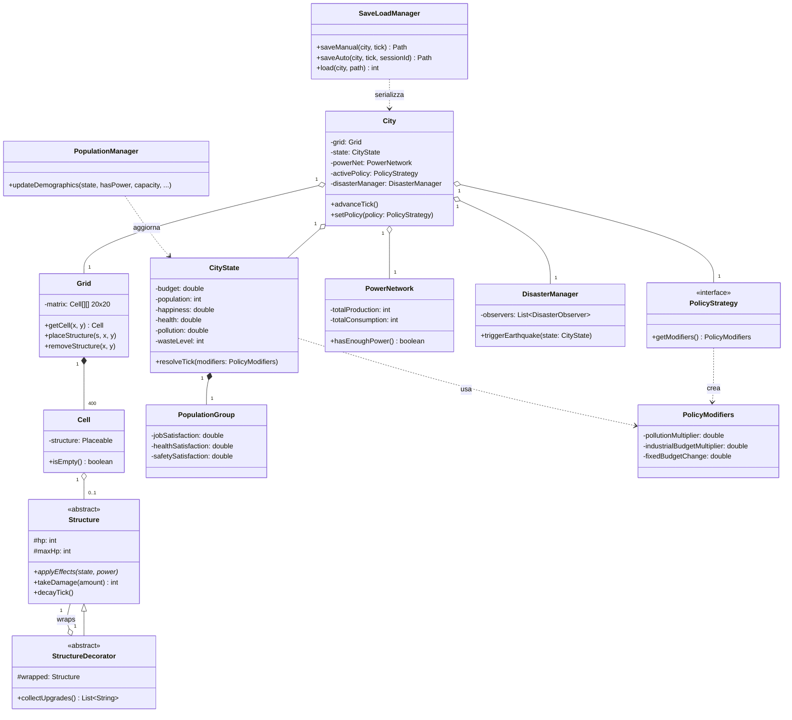
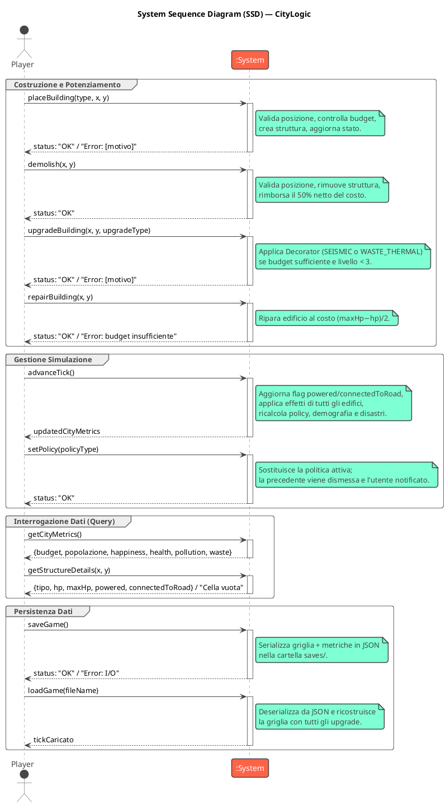
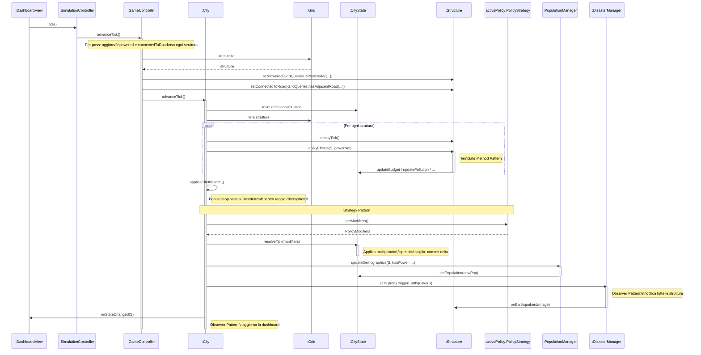
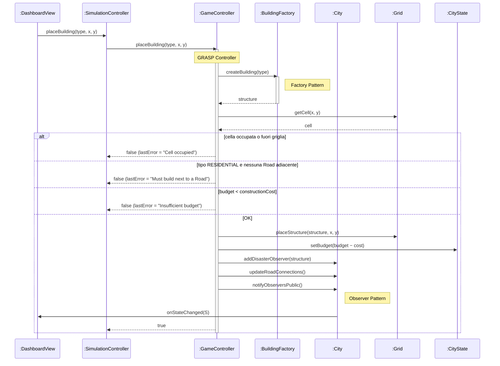
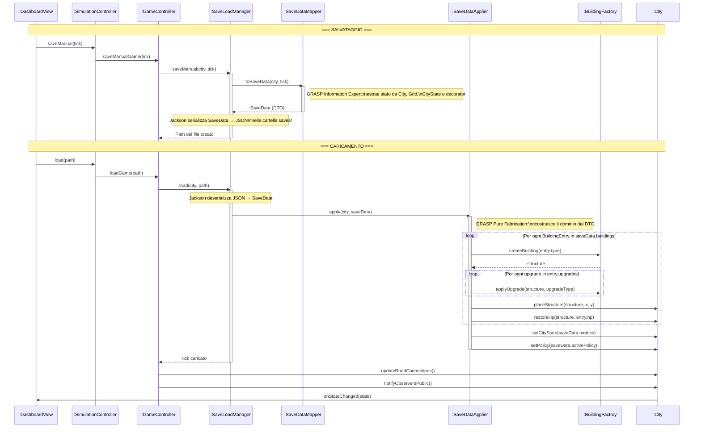

# Documento di Design — CityLogic City Simulator

**Versione:** 1.1 — 2026-05-18

---

## 1. Domain Model

Il dominio di CityLogic ruota attorno alla classe `City`, che orchestra tutti i sottosistemi della simulazione. La `City` possiede una `Grid` 20×20 di celle (`Cell`), ognuna delle quali può contenere al massimo una struttura (`Structure`). Lo stato globale della città — budget, popolazione, happiness, health, pollution, waste — è raccolto in `CityState`, che accumula i delta prodotti dagli edifici ad ogni tick e li risolve applicando i modificatori della `PolicyStrategy` attiva.

Le strutture concrete (8 tipi: `ResidentialBuilding`, `IndustrialBuilding`, `CommercialBuilding`, `PowerPlant`, `Park`, `Road`, `Hospital`, `WasteManagementCenter`) ereditano da `Structure` (classe astratta) e implementano `applyEffects()` secondo il **Template Method Pattern**. I potenziamenti (`SeismicUpgrade`, `WasteThermalUpgrade`) avvolgono le strutture con il **Decorator Pattern** senza modificarne il codice sorgente.

La `PowerNetwork` tiene traccia del bilancio energetico produzione/consumo. Il `DisasterManager` gestisce i terremoti con probabilità 1%/tick, notificando tutte le strutture registrate tramite il **Observer Pattern** (`DisasterObserver`). Le politiche cittadine (Default, Green, FossilFuel, Austerity) implementano la `PolicyStrategy` (**Strategy Pattern**) e alterano i moltiplicatori di `CityState.resolveTick()`. Il `SaveLoadManager` serializza e deserializza lo stato completo in JSON tramite Jackson (**Pure Fabrication**). Il `PopulationManager` calcola ogni tick la crescita demografica e le tre soddisfazioni del `PopulationGroup` (lavoro, salute, sicurezza).

---

## 2. System Sequence Diagrams

Il diagramma seguente mostra le interazioni tra l'attore esterno (Player) e il Sistema visto come scatola nera. Documenta le 4 categorie di operazioni disponibili: costruzione/potenziamento, gestione simulazione, interrogazione dati e persistenza.

---

## 3. Design Class Model

Il modello di design riflette la struttura tecnica completa, incluso il layer UI e il facade. I pattern architetturali chiave sono:

- **Facade** — `SimulationController` è un wrapper leggero attorno a `GameController`; la UI non tocca mai il dominio direttamente.
- **GRASP Controller** — `GameController` è l'unico punto di ingresso per le operazioni che mutano lo stato (place, demolish, repair, repairAll, upgrade, policy change, save/load).
- **Strategy** — `PolicyStrategy` con 4 implementazioni; `CityState.resolveTick(PolicyModifiers)` applica i modificatori senza conoscere la policy concreta.
- **Observer** — `City` notifica `StateObserver` (la UI) ad ogni tick; `DisasterManager` notifica `DisasterObserver` (le strutture) ad ogni terremoto.
- **Decorator** — `StructureDecorator` avvolge `Structure` per aggiungere comportamento (dimezzamento danni, recupero termico) senza modificare le classi base.
- **Factory** — `BuildingFactory` centralizza la costruzione di tutte le istanze `Structure` e la riapplicazione degli upgrade al caricamento del salvataggio.
- **Template Method** — `Structure` definisce lo scheletro del ciclo di vita (decayTick, applyEffects, takeDamage); ogni sottoclasse sovrascrive solo `applyEffects()` e `getType()`.

```mermaid
classDiagram
    direction TB

    %% --- LAYER UI ---
    class DashboardView {
        +onStateChanged(state: CityState)
        +launch()
    }
    class SimulationController {
        +tick()
        +placeBuilding(type, x, y) boolean
        +demolish(x, y) boolean
        +repair(x, y) boolean
        +repairAll() boolean
        +upgrade(x, y, type) boolean
        +setPolicy(policy)
        +saveManual(tick) Path
        +load(path) int
    }

    %% --- DOMAIN CONTROLLER ---
    class GameController {
        -city: City
        +advanceTick()
        +placeBuilding(type, x, y) boolean
        +demolish(x, y) boolean
        +repair(x, y) boolean
        +repairAll() boolean
        +upgradeBuilding(x, y, type) boolean
        +changePolicy(policy)
        +saveManualGame(tick) Path
        +loadGame(path) int
    }

    %% --- CORE DOMAIN ---
    class City {
        -grid: Grid
        -state: CityState
        -powerNet: PowerNetwork
        -activePolicy: PolicyStrategy
        -disasterManager: DisasterManager
        +advanceTick()
        +setPolicy(PolicyStrategy)
        +addObserver(StateObserver)
        +notifyObserversPublic()
    }

    class Grid {
        -matrix: Cell[][] 20x20
        +getCell(x, y) Cell
        +placeStructure(s, x, y)
        +removeStructure(x, y)
        +isCellEmpty(x, y) boolean
    }

    class Cell {
        -structure: Placeable
        +getStructure() Placeable
        +isEmpty() boolean
    }

    class CityState {
        -budget: double
        -population: int
        -happiness: double
        -health: double
        -pollution: double
        -wasteLevel: int
        -populationGroup: PopulationGroup
        +resolveTick(PolicyModifiers)
        +updateBudget(double)
        +setBudget(double)
    }

    class PopulationGroup {
        -jobSatisfaction: double
        -healthSatisfaction: double
        -safetySatisfaction: double
    }

    class PopulationManager {
        +updateDemographics(state, hasPower, maxCap, ...)
    }

    class PowerNetwork {
        +addProduction(int)
        +addConsumption(int)
        +hasEnoughPower() boolean
        +reset()
    }

    class DisasterManager {
        -observers: List~DisasterObserver~
        +addObserver(DisasterObserver)
        +removeObserver(DisasterObserver)
        +triggerEarthquake(CityState)
    }

    class SaveLoadManager {
        +saveManual(City, tick) Path
        +saveAuto(City, tick, sessionId) Path
        +load(City, Path) int
    }

    class BuildingFactory {
        <<utility>>
        +createBuilding(type)$ Structure
    }

    class GridQueries {
        <<utility>>
        +isPoweredAt(grid, x, y)$ boolean
        +hasAdjacentRoad(grid, x, y)$ boolean
        POWER_RADIUS = 5
    }

    %% --- INTERFACES ---
    class Placeable {
        <<interface>>
        +getType() StructureType
    }
    class PolicyStrategy {
        <<interface>>
        +getModifiers() PolicyModifiers
    }
    class StateObserver {
        <<interface>>
        +onStateChanged(CityState)
    }
    class DisasterObserver {
        <<interface>>
        +onEarthquake(int)
    }

    %% --- STRUCTURES (Template Method) ---
    class Structure {
        <<abstract>>
        #hp: int
        #maxHp: int
        #powered: boolean
        #connectedToRoad: boolean
        +applyEffects(CityState, PowerNetwork)*
        +getType() StructureType*
        +takeDamage(int) int
        +decayTick()
        +fullRepair()
    }

    class ResidentialBuilding
    class IndustrialBuilding
    class CommercialBuilding
    class PowerPlant
    class Park
    class Road
    class Hospital
    class WasteManagementCenter

    %% --- DECORATORS ---
    class StructureDecorator {
        <<abstract>>
        #wrapped: Structure
        +getUpgradeLevel() int
        +collectUpgrades() List~String~
    }
    class SeismicUpgrade {
        COST = 500
        +takeDamage(int) int
    }
    class WasteThermalUpgrade {
        COST = 700
        +applyEffects(CityState, PowerNetwork)
    }

    %% --- STRATEGIES ---
    class PolicyModifiers {
        -pollutionMultiplier: double
        -industrialBudgetMultiplier: double
        -fixedBudgetChange: double
        -fixedHappinessChange: double
    }
    class DefaultPolicy
    class GreenPolicy
    class AusterityPolicy
    class FossilFuelPolicy

    %% --- RELATIONSHIPS ---
    DashboardView ..|> StateObserver
    DashboardView --> SimulationController : usa
    SimulationController --> GameController : delega

    GameController "1" o-- "1" City
    GameController ..> BuildingFactory : usa
    GameController ..> GridQueries : usa

    City "1" o-- "1" Grid
    City "1" o-- "1" CityState
    City "1" o-- "1" PowerNetwork
    City "1" o-- "1" PolicyStrategy
    City "1" o-- "1" DisasterManager
    City "1" o-- "*" StateObserver : notifica
    City ..> PopulationManager : usa

    Grid "1" *-- "400" Cell
    Cell "1" o-- "0..1" Placeable

    CityState "1" *-- "1" PopulationGroup
    CityState ..> PolicyModifiers : usa
    PolicyStrategy ..> PolicyModifiers : crea

    Structure ..|> Placeable
    Structure ..|> DisasterObserver
    Structure <|-- ResidentialBuilding
    Structure <|-- IndustrialBuilding
    Structure <|-- CommercialBuilding
    Structure <|-- PowerPlant
    Structure <|-- Park
    Structure <|-- Road
    Structure <|-- Hospital
    Structure <|-- WasteManagementCenter

    Structure <|-- StructureDecorator
    StructureDecorator "1" o-- "1" Structure : wraps
    StructureDecorator <|-- SeismicUpgrade
    StructureDecorator <|-- WasteThermalUpgrade

    DefaultPolicy ..|> PolicyStrategy
    GreenPolicy ..|> PolicyStrategy
    AusterityPolicy ..|> PolicyStrategy
    FossilFuelPolicy ..|> PolicyStrategy

    DisasterManager ..> DisasterObserver : notifica
    SaveLoadManager ..> BuildingFactory : usa
```

---

## 4. Internal Sequence Diagrams

I tre diagrammi interni documentano le interazioni tra i componenti del dominio per le operazioni più significative, annotando i pattern GRASP e GoF applicati.

### 4.1 advanceTick() — Flusso tick completo

La UI delega al `SimulationController` (Facade), che delega al `GameController` (GRASP Controller). Il controller esegue una **pre-pass** per aggiornare i flag `powered` e `connectedToRoad` su ogni struttura, poi delega a `City` (Information Expert). `City` itera sugli edifici applicando gli effetti via polimorfismo (Template Method / GRASP Polymorphism), poi applica i modificatori della policy attiva (GoF Strategy) e aggiorna la demografia (`PopulationManager`). Infine notifica la UI via Observer.

### 4.2 placeBuilding(type, x, y)

Il `GameController` riceve la richiesta dalla UI tramite facade, usa `BuildingFactory` per istanziare la struttura (GoF Factory), valida le precondizioni (budget, cella libera, strada per i Residential) e piazza. In caso di successo notifica gli observer.

### 4.3 saveGame() / loadGame()

Il `GameController` delega I/O al `SaveLoadManager` (GRASP Pure Fabrication). Al salvataggio, `SaveDataMapper` estrae i DTO dal dominio. Al caricamento, `SaveDataApplier` ricostruisce la griglia usando `BuildingFactory` per ogni struttura e riapplica gli upgrade in ordine.

