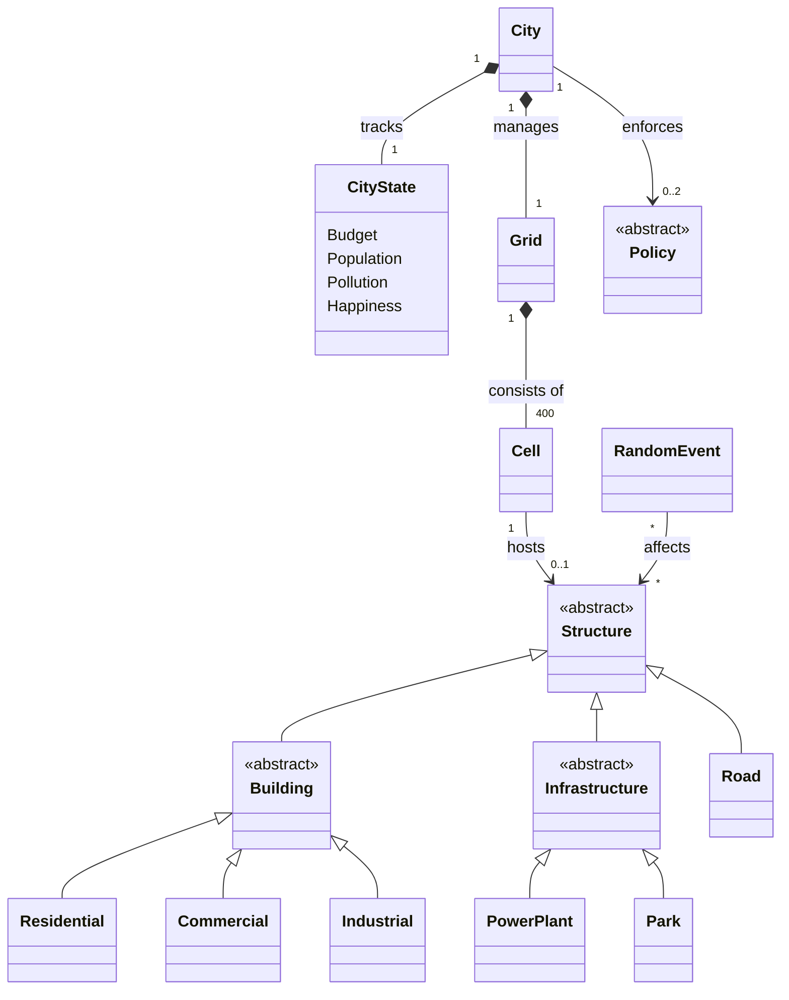

```mermaid
classDiagram
%% Entità centrali
    class City
    class CityState {
        Budget
        Population
        Pollution
        Happiness
    }
    class Grid
    class Cell

%% Strutture
    class Structure {
        <<abstract>>
    }
    class Building {
        <<abstract>>
    }
    class Infrastructure {
        <<abstract>>
    }
    class Residential
    class Commercial
    class Industrial
    class PowerPlant
    class Park
    class Road

%% Sistemi Dinamici
    class Policy {
        <<abstract>>
    }
    class RandomEvent

%% Relazioni (Corrette per compatibilità IDE)
    City "1" *-- "1" CityState : tracks
    City "1" *-- "1" Grid : manages
    City "1" --> "0..2" Policy : enforces
    Grid "1" *-- "400" Cell : consists of
    Cell "1" --> "0..1" Structure : hosts

%% Ereditarietà
    Structure <|-- Building
    Structure <|-- Infrastructure
    Structure <|-- Road
    Building <|-- Residential
    Building <|-- Commercial
    Building <|-- Industrial
    Infrastructure <|-- PowerPlant
    Infrastructure <|-- Park

%% Eventi
    RandomEvent "*" --> "*" Structure : affects
```