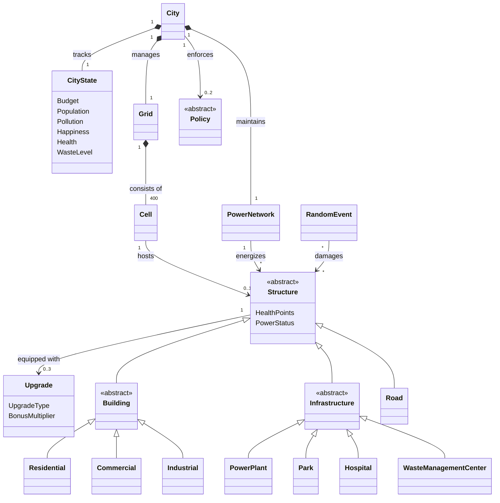

```mermaid
classDiagram
    %% --- Entità Centrali ---
    class City
    class CityState {
        Budget
        Population
        Pollution
        Happiness
        Health
        WasteLevel
    }
    class Grid
    class Cell

    %% --- Strutture e Upgrade ---
    class Structure {
        <<abstract>>
        HealthPoints
        PowerStatus
    }
    class Upgrade {
        UpgradeType
        BonusMultiplier
    }
    class Building {
        <<abstract>>
    }
    class Infrastructure {
        <<abstract>>
    }

    %% --- Tipologie di Edifici ---
    class Residential
    class Commercial
    class Industrial
    
    %% --- Tipologie di Infrastrutture ---
    class PowerPlant
    class Park
    class Road
    class Hospital
    class WasteManagementCenter

    %% --- Sistemi Dinamici e Reti ---
    class PowerNetwork
    class Policy {
        <<abstract>>
    }
    class RandomEvent

    %% --- Relazioni (Composizione e Associazione) ---
    City "1" *-- "1" CityState : tracks
    City "1" *-- "1" Grid : manages
    City "1" *-- "1" PowerNetwork : maintains
    City "1" --> "0..2" Policy : enforces
    
    Grid "1" *-- "400" Cell : consists of
    Cell "1" --> "0..1" Structure : hosts
    
    PowerNetwork "1" --> "*" Structure : energizes
    Structure "1" --> "0..3" Upgrade : equipped with
    
    %% --- Ereditarietà ---
    Structure <|-- Building
    Structure <|-- Infrastructure
    Structure <|-- Road
    
    Building <|-- Residential
    Building <|-- Commercial
    Building <|-- Industrial
    
    Infrastructure <|-- PowerPlant
    Infrastructure <|-- Park
    Infrastructure <|-- Hospital
    Infrastructure <|-- WasteManagementCenter
    
    %% --- Eventi ---
    RandomEvent "*" --> "*" Structure : damages

```

