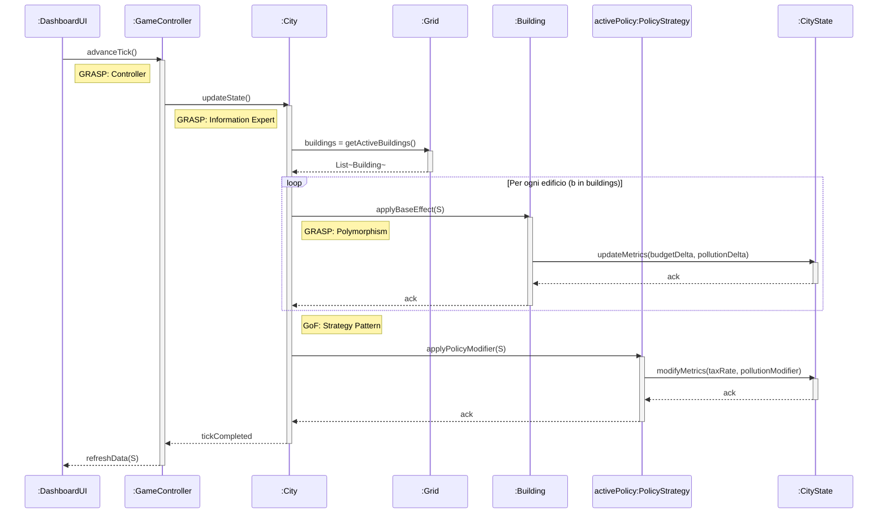
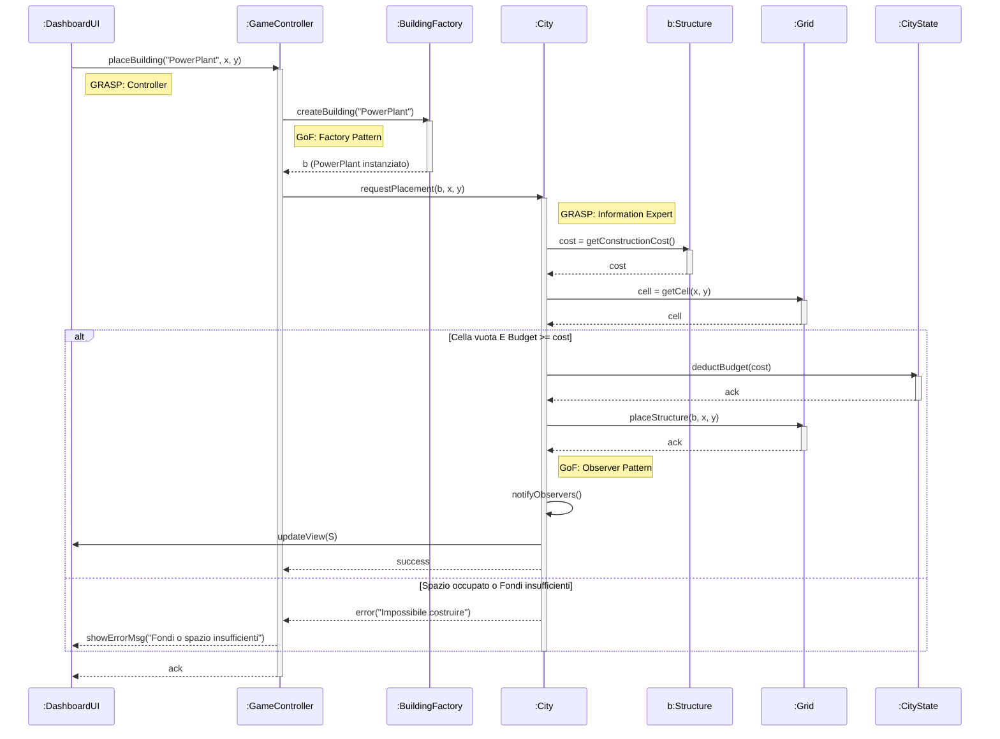
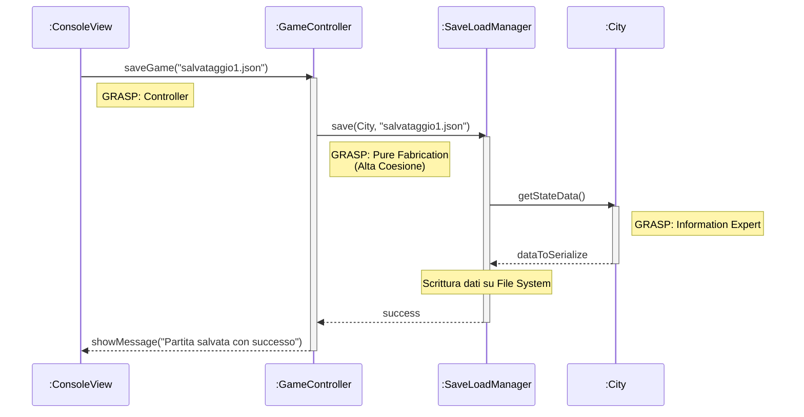

## **advanceTick()**

### GRASP - Controller: Il messaggio iniziale advanceTick() parte dalla DashboardUI (livello di presentazione) e viene ricevuto dal GameController. Il Controller agisce come intermediario, disaccoppiando l'interfaccia grafica dalla logica di dominio (Low Coupling). Non esegue i calcoli, ma delega l'operazione.

### GRASP - Information Expert: Il GameController delega l'aggiornamento alla classe City invocando updateState(). La classe City è l'Esperto dell'Informazione per questa operazione, poiché possiede i riferimenti alla Grid (dove si trovano gli edifici), allo stato globale CityState e all'ordinanza attiva PolicyStrategy.

### GRASP - Polymorphism: Nel ciclo loop, la classe City invoca applyBaseEffect(S) sull'interfaccia/classe astratta Building. Il sistema usa il polimorfismo per calcolare gli effetti: la classe City non ha bisogno di sapere se sta parlando con una centrale elettrica o una zona residenziale (non ci sono costrutti switch o if-else). Ogni specifica sottoclasse di Building sa come aggiornare le proprie metriche.

### GoF - Strategy Pattern: Dopo aver calcolato gli effetti base di tutti gli edifici, la City delega il calcolo delle tasse o delle riduzioni dell'inquinamento all'oggetto activePolicy(istanza dell'interfaccia PolicyStrategy). La City è il Context del pattern:non conosce l'algoritmo specifico della politica attiva (es. Tassa Ambientale vs Espansione Industriale), ma invoca semplicemente applyPolicyModifier(S). Questo garantisce un design aperto all'estensione ma chiuso alla modifica (Open-Closed Principle).

## **placeBuilding("PowerPlant", x, y)**

### GRASP - Controller: Il GameController intercetta l'input dell'utente dalla DashboardUI. Non calcola nulla, ma coordina il lavoro delle altre classi (Low Coupling).

### GoF - Factory Pattern: Il GameController usa la BuildingFactory per creare l'oggetto b. In questo modo, né il Controller né la Città devono usare la parola chiave new PowerPlant(). Il sistema dipenderà dall'astrazione (Structure), rispettando il principio di Inversione delle Dipendenze.

### GRASP - Information Expert: Il GameController passa l'oggetto appena creato alla City. La City è l'esperto dell'informazione incaricato di validare la richiesta, poiché è l'unica classe che ha accesso sia allo stato finanziario (CityState) sia alla mappa topografica (Grid).

### Polimorfismo: Quando la City interroga l'oggetto b chiamando getConstructionCost(), non sa (e non le interessa sapere) che si tratta di una centrale elettrica. Usa l'interfaccia generale per ottenere il costo.

### GoF - Observer Pattern: Nel ramo di successo dell' alt, dopo aver aggiornato i dati, la City chiama notifyObservers(). La UI, che è in ascolto, viene notificata e aggiorna i contatori a schermo, mantenendo la separazione netta tra Modello (dati) e Vista (grafica).

## Save()
