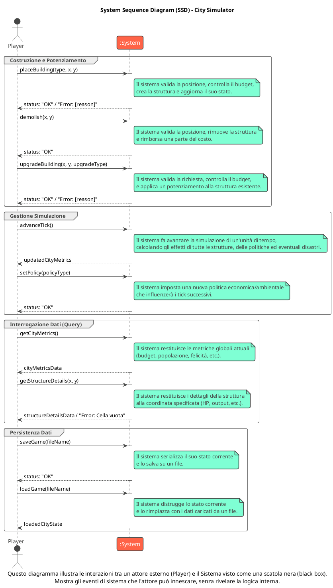

```plantuml
@startuml
!theme vibrant

title System Sequence Diagram (SSD) - City Simulator
caption Questo diagramma illustra le interazioni tra un attore esterno (Player) e il Sistema visto come una scatola nera (black box).\nMostra gli eventi di sistema che l'attore può innescare, senza rivelare la logica interna.

actor Player
participant ":System" as System

group Costruzione e Potenziamento
    Player -> System: placeBuilding(type, x, y)
    activate System
    note right of System: Il sistema valida la posizione, controlla il budget,\ncrea la struttura e aggiorna il suo stato.
    System --> Player: status: "OK" / "Error: [reason]"
    deactivate System

    Player -> System: demolish(x, y)
    activate System
    note right of System: Il sistema valida la posizione, rimuove la struttura\ne rimborsa una parte del costo.
    System --> Player: status: "OK"
    deactivate System
    
    Player -> System: upgradeBuilding(x, y, upgradeType)
    activate System
    note right of System: Il sistema valida la richiesta, controlla il budget,\ne applica un potenziamento alla struttura esistente.
    System --> Player: status: "OK" / "Error: [reason]"
    deactivate System
end

group Gestione Simulazione
    Player -> System: advanceTick()
    activate System
    note right of System: Il sistema fa avanzare la simulazione di un'unità di tempo,\ncalcolando gli effetti di tutte le strutture, delle politiche ed eventuali disastri.
    System --> Player: updatedCityMetrics
    deactivate System

    Player -> System: setPolicy(policyType)
    activate System
    note right of System: Il sistema imposta una nuova politica economica/ambientale\nche influenzerà i tick successivi.
    System --> Player: status: "OK"
    deactivate System
end

group Interrogazione Dati (Query)
    Player -> System: getCityMetrics()
    activate System
    note right of System: Il sistema restituisce le metriche globali attuali\n(budget, popolazione, felicità, etc.).
    System --> Player: cityMetricsData
    deactivate System

    Player -> System: getStructureDetails(x, y)
    activate System
    note right of System: Il sistema restituisce i dettagli della struttura\nalla coordinata specificata (HP, output, etc.).
    System --> Player: structureDetailsData / "Error: Cella vuota"
    deactivate System
end

group Persistenza Dati
    Player -> System: saveGame(fileName)
    activate System
    note right of System: Il sistema serializza il suo stato corrente\ne lo salva su un file.
    System --> Player: status: "OK"
    deactivate System

    Player -> System: loadGame(fileName)
    activate System
    note right of System: Il sistema distrugge lo stato corrente\ne lo rimpiazza con i dati caricati da un file.
    System --> Player: loadedCityState
    deactivate System
end

@enduml
```