# Class Diagram - City Simulator

Questo diagramma mostra la reale struttura tecnica, le interfacce e le gerarchie presenti nel package di dominio, evidenziando le implementazioni esatte dei design pattern (Decorator, Strategy, Observer).

```mermaid
classDiagram
    direction TB

    %% --- ENUMS ---
    class StructureType {
        <<enumeration>>
        RESIDENTIAL
        INDUSTRIAL
        COMMERCIAL
        POWER_PLANT
        PARK
        ROAD
        HOSPITAL
        WASTE_CENTER
    }

    %% --- INTERFACES ---
    class Placeable {
        <<interface>>
        +getType() StructureType
    }
    class PolicyStrategy {
        <<interface>>
        +getModifiers() PolicyModifiers
    }
    class StateObserver {
        <<interface>>
        +onStateChanged(state: CityState)
    }
    class DisasterObserver {
        <<interface>>
        +onEarthquake(magnitude: int)
    }

    %% --- CORE ---
    class GameController {
        -city: City
        +placeBuilding(type: String, x: int, y: int)
        +demolish(x: int, y: int)
        +advanceTick()
    }
    
    class City {
        -grid: Grid
        -state: CityState
        -powerNet: PowerNetwork
        -activePolicy: PolicyStrategy
        -disasterManager: DisasterManager
        -observers: List~StateObserver~
        +advanceTick()
        +setPolicy(policy: PolicyStrategy)
        +addObserver(observer: StateObserver)
        -notifyObservers()
    }
    
    class Grid {
        -matrix: Cell[][]
        +getCell(x: int, y: int) Cell
    }
    
    class Cell {
        -structure: Placeable
        +getStructure() Placeable
        +setStructure(structure: Placeable)
        +isEmpty() boolean
    }
    
    class CityState {
        -budget: double
        -population: int
        -happiness: double
        -pollution: double
        +resolveTick(modifiers: PolicyModifiers)
        +updateBudget(amount: double)
        +getBudget() double
    }
    
    class PowerNetwork {
        -totalGenerated: int
        -totalConsumed: int
        +registerProducer(amount: int)
        +registerConsumer(amount: int)
        +hasSufficientPower() boolean
    }
    
    class DisasterManager {
        -observers: List~DisasterObserver~
        +addObserver(observer: DisasterObserver)
        +removeObserver(observer: DisasterObserver)
        +triggerEarthquake(state: CityState)
    }
    
    class SaveLoadManager {
        +saveGame(city: City, path: String) boolean
        +loadGame(path: String) City
    }

    %% --- STRUCTURES (Template Method) ---
    class Structure {
        <<abstract>>
        #hp: int
        #maxHp: int
        +applyEffects(state: CityState, powerNet: PowerNetwork)*
        +getType() StructureType*
        +takeDamage(amount: int)
    }
    class ResidentialBuilding
    class IndustrialBuilding
    class CommercialBuilding
    class PowerPlant
    class Park
    class Road
    class Hospital
    class WasteManagementCenter

    %% --- DECORATORS ---
    class StructureDecorator {
        <<abstract>>
        #wrapped: Structure
    }
    class SeismicUpgrade
    class WasteThermalUpgrade

    %% --- STRATEGIES (Policies) ---
    class PolicyModifiers {
        -pollutionMultiplier: double
        -fixedBudgetChange: int
    }
    class DefaultPolicy
    class GreenPolicy
    class AusterityPolicy
    class FossilFuelPolicy

    %% --- FACTORY ---
    class BuildingFactory {
        +createBuilding(type: String)$ Structure
        +applyUpgrade(base: Structure, upgradeType: String)$ Structure
    }

    %% --- RELATIONSHIPS & PATTERNS ---
    Structure ..|> Placeable
    Structure ..|> DisasterObserver

    %% GameController owns the City (Composition)
    GameController "1" *-- "1" City : controls
    
    %% City components (Composition)
    City "1" *-- "1" Grid : contains
    City "1" *-- "1" CityState : tracks
    City "1" *-- "1" PowerNetwork : manages
    City "1" *-- "1" DisasterManager : uses
    
    %% City has an active policy (Aggregation)
    City "1" o-- "1" PolicyStrategy : applies

    %% Grid owns Cells (Composition)
    Grid "1" *-- "*" Cell : composed of
    
    %% Cell aggregates Placeable (Aggreagtion, structure can be moved/destroyed)
    Cell "1" o-- "0..1" Placeable : holds

    ResidentialBuilding --|> Structure
    IndustrialBuilding --|> Structure
    CommercialBuilding --|> Structure
    PowerPlant --|> Structure
    Park --|> Structure
    Road --|> Structure
    Hospital --|> Structure
    WasteManagementCenter --|> Structure

    %% Decorator Pattern
    StructureDecorator --|> Structure
    StructureDecorator "1" o-- "1" Structure : wraps
    SeismicUpgrade --|> StructureDecorator
    WasteThermalUpgrade --|> StructureDecorator

    %% Strategy Pattern
    DefaultPolicy ..|> PolicyStrategy
    GreenPolicy ..|> PolicyStrategy
    AusterityPolicy ..|> PolicyStrategy
    FossilFuelPolicy ..|> PolicyStrategy

    CityState ..> PolicyModifiers : uses
    PolicyStrategy ..> PolicyModifiers : creates

    %% Factory Dependencies
    GameController ..> BuildingFactory : uses
    SaveLoadManager ..> BuildingFactory : uses

    %% Other Dependencies
    City "1" o-- "*" StateObserver : notifies
    Placeable ..> StructureType : returns
    Structure ..> StructureType : returns
```

