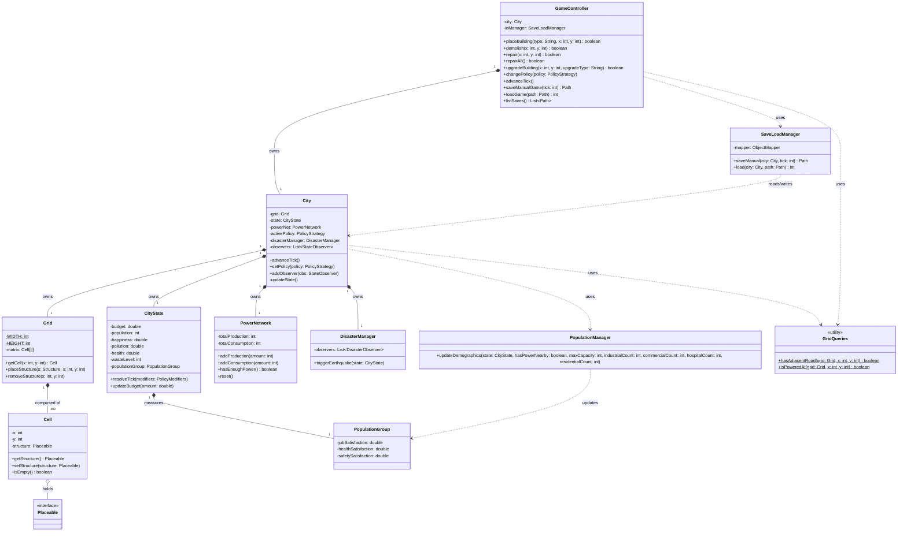
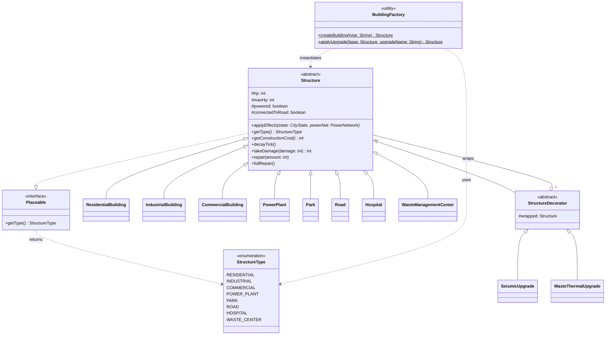
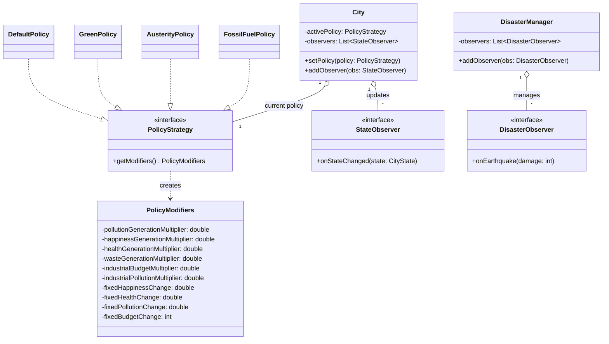
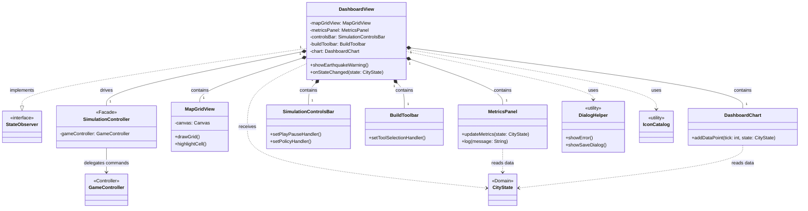

# Class Diagram - City Simulator

Essendo un sistema complesso, il Class Diagram è stato suddiviso in **quattro moduli separati** per renderne più agevole la consultazione e il rendering in Mermaid:

1. **Architettura Core**: I controller principali e i sistemi di simulazione del mondo.
2. **Strutture ed Edifici**: La gerarchia delle costruzioni, le interfacce e i Decorator.
3. **Politiche e Observer**: Il sistema di policy governative e la notifica degli eventi.
4. **Livello UI**: I componenti dell'interfaccia JavaFX e il controller di simulazione.

---

## 1. Architettura Core (Controller e Mondo)

---

## 2. Strutture e Gerarchia degli Edifici (Template Method & Decorator)

---

## 3. Politiche Economiche e Observer Pattern

---

## 4. Livello UI (User Interface e JavaFX)

