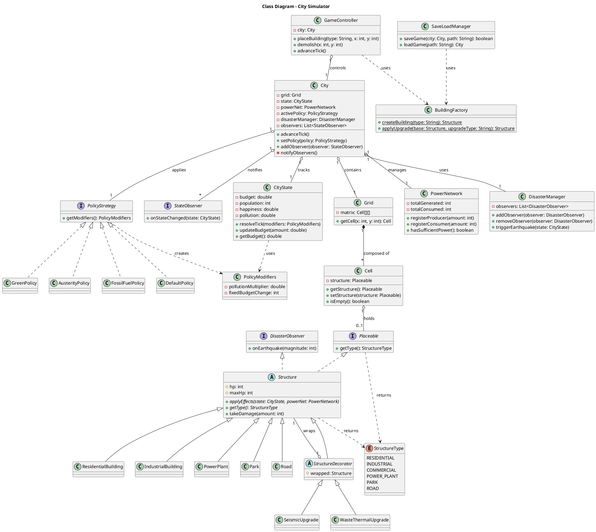

```plantuml

@startuml
title Class Diagram - City Simulator

' --- ENUMS ---
enum StructureType {
    RESIDENTIAL
    INDUSTRIAL
    COMMERCIAL
    POWER_PLANT
    PARK
    ROAD
}

' --- INTERFACES ---
interface Placeable {
    + getType(): StructureType
}
interface PolicyStrategy {
    + getModifiers(): PolicyModifiers
}
interface StateObserver {
    + onStateChanged(state: CityState)
}
interface DisasterObserver {
    + onEarthquake(magnitude: int)
}

' --- CORE ---
class GameController {
    - city: City
    + placeBuilding(type: String, x: int, y: int)
    + demolish(x: int, y: int)
    + advanceTick()
}

class City {
    - grid: Grid
    - state: CityState
    - powerNet: PowerNetwork
    - activePolicy: PolicyStrategy
    - disasterManager: DisasterManager
    - observers: List<StateObserver>
    + advanceTick()
    + setPolicy(policy: PolicyStrategy)
    + addObserver(observer: StateObserver)
    - notifyObservers()
}

class Grid {
    - matrix: Cell[][]
    + getCell(x: int, y: int): Cell
}

class Cell {
    - structure: Placeable
    + getStructure(): Placeable
    + setStructure(structure: Placeable)
    + isEmpty(): boolean
}

class CityState {
    - budget: double
    - population: int
    - happiness: double
    - pollution: double
    + resolveTick(modifiers: PolicyModifiers)
    + updateBudget(amount: double)
    + getBudget(): double
}

class PowerNetwork {
    - totalGenerated: int
    - totalConsumed: int
    + registerProducer(amount: int)
    + registerConsumer(amount: int)
    + hasSufficientPower(): boolean
}

class DisasterManager {
    - observers: List<DisasterObserver>
    + addObserver(observer: DisasterObserver)
    + removeObserver(observer: DisasterObserver)
    + triggerEarthquake(state: CityState)
}

class SaveLoadManager {
    + saveGame(city: City, path: String): boolean
    + loadGame(path: String): City
}

' --- STRUCTURES (Template Method) ---
abstract class Structure {
    # hp: int
    # maxHp: int
    + {abstract} applyEffects(state: CityState, powerNet: PowerNetwork)
    + {abstract} getType(): StructureType
    + takeDamage(amount: int)
}
class ResidentialBuilding
class IndustrialBuilding
class PowerPlant
class Park
class Road

' --- DECORATORS ---
abstract class StructureDecorator {
    # wrapped: Structure
}
class SeismicUpgrade
class WasteThermalUpgrade

' --- STRATEGIES (Policies) ---
class PolicyModifiers {
    - pollutionMultiplier: double
    - fixedBudgetChange: int
}
class DefaultPolicy
class GreenPolicy
class AusterityPolicy
class FossilFuelPolicy

' --- FACTORY ---
class BuildingFactory {
    + {static} createBuilding(type: String): Structure
    + {static} applyUpgrade(base: Structure, upgradeType: String): Structure
}

' --- RELATIONSHIPS & PATTERNS ---
Placeable <|.. Structure
DisasterObserver <|.. Structure

GameController "1" o-- "1" City : controls
City "1" o-- "1" Grid : contains
City "1" o-- "1" CityState : tracks
City "1" o-- "1" PowerNetwork : manages
City "1" o-- "1" DisasterManager : uses
City "1" o-- "1" PolicyStrategy : applies

Grid "1" *-- "*" Cell : composed of
Cell "1" o-- "0..1" Placeable : holds

Structure <|-- ResidentialBuilding
Structure <|-- IndustrialBuilding
Structure <|-- PowerPlant
Structure <|-- Park
Structure <|-- Road

' Decorator Pattern
Structure <|-- StructureDecorator
StructureDecorator "1" o-- "1" Structure : wraps
StructureDecorator <|-- SeismicUpgrade
StructureDecorator <|-- WasteThermalUpgrade

' Strategy Pattern
PolicyStrategy <|.. DefaultPolicy
PolicyStrategy <|.. GreenPolicy
PolicyStrategy <|.. AusterityPolicy
PolicyStrategy <|.. FossilFuelPolicy

CityState ..> PolicyModifiers : uses
PolicyStrategy ..> PolicyModifiers : creates

' Factory Dependencies
GameController ..> BuildingFactory : uses
SaveLoadManager ..> BuildingFactory : uses

' Other Dependencies
City "1" o-- "*" StateObserver : notifies
Placeable ..> StructureType : returns
Structure ..> StructureType : returns
@enduml
```
