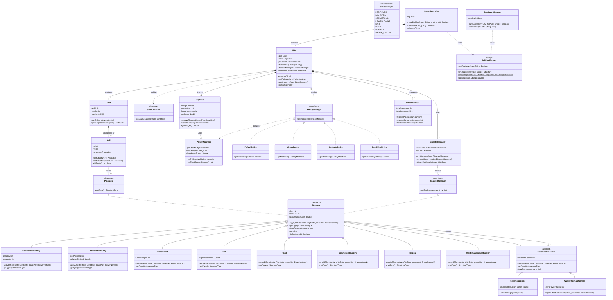

```mermaid
classDiagram
    direction TB

    %% ==========================================
    %% INTERFACES
    %% ==========================================
    class Placeable {
        <<interface>>
        +getType() StructureType
    }
    class PolicyStrategy {
        <<interface>>
        +getModifiers() PolicyModifiers
    }
    class StateObserver {
        <<interface>>
        +onStateChanged(state: CityState)
    }
    class DisasterObserver {
        <<interface>>
        +onEarthquake(magnitude: int)
    }

    %% ==========================================
    %% ENUMERATIONS
    %% ==========================================
    class StructureType {
        <<enumeration>>
        RESIDENTIAL
        INDUSTRIAL
        COMMERCIAL
        POWER_PLANT
        PARK
        ROAD
        HOSPITAL
        WASTE_CENTER
    }

    %% ==========================================
    %% CORE DOMAIN CLASSES
    %% ==========================================
    class City {
        -grid: Grid
        -state: CityState
        -powerNet: PowerNetwork
        -activePolicy: PolicyStrategy
        -disasterManager: DisasterManager
        -observers: List~StateObserver~
        +advanceTick()
        +setPolicy(policy: PolicyStrategy)
        +addObserver(obs: StateObserver)
        -notifyObservers()
    }

    class GameController {
        -city: City
        +placeBuilding(type: String, x: int, y: int) boolean
        +demolish(x: int, y: int) boolean
        +advanceTick()
    }

    class Grid {
        -width: int
        -height: int
        -matrix: Cell[][]
        +getCell(x: int, y: int) Cell
        +getNeighbors(x: int, y: int) List~Cell~
    }

    class Cell {
        -x: int
        -y: int
        -structure: Placeable
        +getStructure() Placeable
        +setStructure(structure: Placeable)
        +isEmpty() boolean
    }

    class CityState {
        -budget: double
        -population: int
        -happiness: double
        -pollution: double
        +resolveTick(modifiers: PolicyModifiers)
        +updateBudget(amount: double)
        +getBudget() double
    }

    class PowerNetwork {
        -totalGenerated: int
        -totalConsumed: int
        +registerProducer(amount: int)
        +registerConsumer(amount: int)
        +hasSufficientPower() boolean
    }

    class SaveLoadManager {
        -savePath: String
        +saveGame(city: City, filePath: String) boolean
        +loadGame(filePath: String) City
    }

    %% ==========================================
    %% STRUCTURES (TEMPLATE METHOD PATTERN)
    %% ==========================================
    class Structure {
        <<abstract>>
        #hp: int
        #maxHp: int
        #constructionCost: double
        +applyEffects(state: CityState, powerNet: PowerNetwork)*
        +getType() StructureType*
        +takeDamage(damage: int)
        +repair()
        +isDestroyed() boolean
    }

    class ResidentialBuilding {
        -capacity: int
        -residents: int
        +applyEffects(state: CityState, powerNet: PowerNetwork)
        +getType() StructureType
    }

    class IndustrialBuilding {
        -jobsProvided: int
        -pollutionEmitted: double
        +applyEffects(state: CityState, powerNet: PowerNetwork)
        +getType() StructureType
    }

    class PowerPlant {
        -powerOutput: int
        +applyEffects(state: CityState, powerNet: PowerNetwork)
        +getType() StructureType
    }

    class Park {
        -happinessBoost: double
        +applyEffects(state: CityState, powerNet: PowerNetwork)
        +getType() StructureType
    }

    class Road {
        +applyEffects(state: CityState, powerNet: PowerNetwork)
        +getType() StructureType
    }

    class CommercialBuilding {
        +applyEffects(state: CityState, powerNet: PowerNetwork)
        +getType() StructureType
    }

    class Hospital {
        +applyEffects(state: CityState, powerNet: PowerNetwork)
        +getType() StructureType
    }

    class WasteManagementCenter {
        +applyEffects(state: CityState, powerNet: PowerNetwork)
        +getType() StructureType
    }

    %% ==========================================
    %% DECORATORS (DECORATOR PATTERN)
    %% ==========================================
    class StructureDecorator {
        <<abstract>>
        #wrapped: Structure
        +applyEffects(state: CityState, powerNet: PowerNetwork)
        +getType() StructureType
        +takeDamage(damage: int)
    }

    class SeismicUpgrade {
        -damageReductionFactor: double
        +takeDamage(damage: int)
    }

    class WasteThermalUpgrade {
        -extraPowerOutput: int
        +applyEffects(state: CityState, powerNet: PowerNetwork)
    }

    %% ==========================================
    %% POLICIES (STRATEGY PATTERN)
    %% ==========================================
    class PolicyModifiers {
        -pollutionMultiplier: double
        -fixedBudgetChange: int
        -happinessBonus: double
        +getPollutionMultiplier() double
        +getFixedBudgetChange() int
    }

    class DefaultPolicy {
        +getModifiers() PolicyModifiers
    }

    class GreenPolicy {
        +getModifiers() PolicyModifiers
    }

    class AusterityPolicy {
        +getModifiers() PolicyModifiers
    }

    class FossilFuelPolicy {
        +getModifiers() PolicyModifiers
    }

    %% ==========================================
    %% FACTORY METHOD
    %% ==========================================
    class BuildingFactory {
        <<utility>>
        -costRegistry: Map~String, Double~
        +createBuilding(type: String)$ Structure
        +applyUpgrade(base: Structure, upgradeType: String)$ Structure
        +getCost(type: String)$ double
    }

    %% ==========================================
    %% DISASTER MANAGEMENT (OBSERVER)
    %% ==========================================
    class DisasterManager {
        -observers: List~DisasterObserver~
        -random: Random
        +addObserver(obs: DisasterObserver)
        +removeObserver(obs: DisasterObserver)
        +triggerEarthquake(state: CityState)
    }

    %% ==========================================
    %% RELATIONSHIPS
    %% ==========================================
    
    %% Aggregation & Composition
    GameController "1" *-- "1" City : controls
    City "1" *-- "1" Grid : contains
    City "1" *-- "1" CityState : tracks
    City "1" *-- "1" PowerNetwork : manages
    City "1" *-- "1" DisasterManager : uses
    
    %% Aggregation
    City "1" o-- "1" PolicyStrategy : applies
    
    Grid "1" *-- "0..*" Cell : composed of
    Cell "1" o-- "0..1" Placeable : holds

    %% Inheritance
    Placeable <|.. Structure
    DisasterObserver <|.. Structure

    Structure <|-- ResidentialBuilding
    Structure <|-- IndustrialBuilding
    Structure <|-- CommercialBuilding
    Structure <|-- PowerPlant
    Structure <|-- Park
    Structure <|-- Road
    Structure <|-- Hospital
    Structure <|-- WasteManagementCenter

    Structure <|-- StructureDecorator
    StructureDecorator "1" o-- "1" Structure : wraps
    StructureDecorator <|-- SeismicUpgrade
    StructureDecorator <|-- WasteThermalUpgrade

    PolicyStrategy <|.. DefaultPolicy
    PolicyStrategy <|.. GreenPolicy
    PolicyStrategy <|.. AusterityPolicy
    PolicyStrategy <|.. FossilFuelPolicy

    %% Dependencies
    CityState ..> PolicyModifiers : uses
    PolicyStrategy ..> PolicyModifiers : creates

    GameController ..> BuildingFactory : uses
    SaveLoadManager ..> BuildingFactory : uses

    City ..> StateObserver : notifies
    DisasterManager ..> DisasterObserver : notifies
```