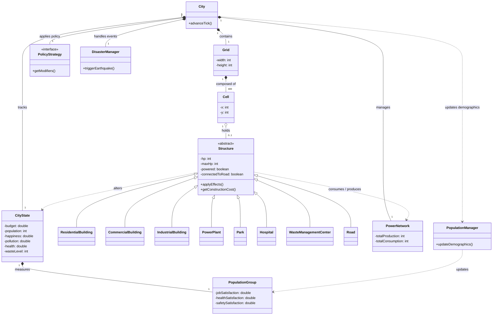

# Domain Model - City Simulator

Il Domain Model illustra i concetti fondamentali del dominio applicativo, omettendo i dettagli implementativi per concentrarsi esclusivamente sulla logica di business, le entità principali del gioco e le loro relazioni concettuali.

