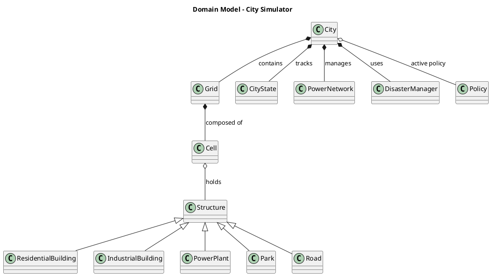

```plantuml
@startuml
title Domain Model - City Simulator

' --- Entità Principali ---
class City
class Grid
class Cell
class CityState
class PowerNetwork
class DisasterManager
class Policy

' --- Strutture ---
class Structure
class ResidentialBuilding
class IndustrialBuilding
class PowerPlant
class Park
class Road

' --- Relazioni ---
City *-- Grid : contains
City *-- CityState : tracks
City *-- PowerNetwork : manages
City *-- DisasterManager : uses
City o-- Policy : active policy

Grid *-- Cell : composed of
Cell o-- Structure : holds

Structure <|-- ResidentialBuilding
Structure <|-- IndustrialBuilding
Structure <|-- PowerPlant
Structure <|-- Park
Structure <|-- Road

@enduml
```