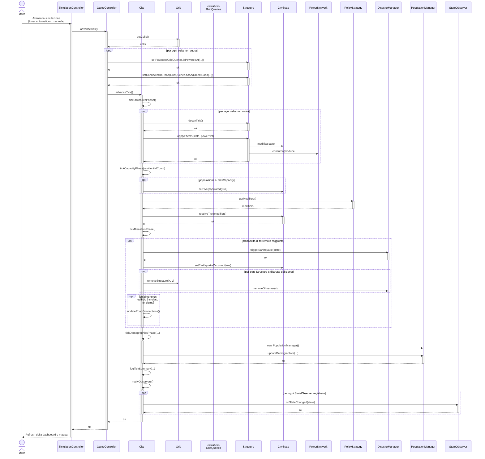

# Diagramma di Sequenza: Avanzamento Tick (`advanceTick`)

```mermaid
sequenceDiagram
    actor User
    participant UI as SimulationController
    participant GC as GameController
    participant City as City
    participant Grid as Grid
    participant Queries as <<static>><br/>GridQueries
    participant Structure as Structure
    participant State as CityState
    participant PowerNet as PowerNetwork
    participant Policy as PolicyStrategy
    participant Disaster as DisasterManager
    participant PopManager as PopulationManager
    participant Observer as StateObserver

    User->>UI: Avanza la simulazione<br/>(timer automatico o manuale)
    activate UI
    UI->>GC: advanceTick()
    activate GC

    %% Fase Pre-Pass
    GC->>Grid: getCells()
    activate Grid
    Grid-->>GC: cells
    deactivate Grid

    loop per ogni cella non vuota
        GC->>Structure: setPowered(GridQueries.isPoweredAt(...))
        activate Structure
        Structure-->>GC: ok
        deactivate Structure

        GC->>Structure: setConnectedToRoad(GridQueries.hasAdjacentRoad(...))
        activate Structure
        Structure-->>GC: ok
        deactivate Structure
    end

    %% Fase Simulazione Dominio
    GC->>City: advanceTick()
    activate City

    City->>City: tickStructuresPhase()
    activate City
    loop per ogni cella non vuota
        City->>Structure: decayTick()
        activate Structure
        Structure-->>City: ok
        deactivate Structure

        City->>Structure: applyEffects(state, powerNet)
        activate Structure
        Structure->>State: modifica stato
        Structure->>PowerNet: consuma/produce
        Structure-->>City: ok
        deactivate Structure
    end
    deactivate City

    City->>City: tickCapacityPhase(residentialCount)
    activate City
    opt popolazione > maxCapacity
        City->>State: setOverpopulated(true)
    end
    deactivate City

    City->>Policy: getModifiers()
    activate Policy
    Policy-->>City: modifiers
    deactivate Policy

    City->>State: resolveTick(modifiers)
    activate State
    State-->>City: ok
    deactivate State

    City->>City: tickDisastersPhase()
    activate City
    opt probabilità di terremoto raggiunta
        City->>Disaster: triggerEarthquake(state)
        activate Disaster
        Disaster-->>City: ok
        deactivate Disaster

        City->>State: setEarthquakeOccurred(true)

        loop per ogni Structure s distrutta dal sisma
            City->>Grid: removeStructure(x, y)
            City->>Disaster: removeObserver(s)
        end

        opt se almeno un edificio è crollato nel sisma
            City->>City: updateRoadConnections()
        end
    end
    deactivate City

    City->>City: tickDemographicsPhase(...)
    activate City
    City->>PopManager: new PopulationManager()
    City->>PopManager: updateDemographics(...)
    activate PopManager
    PopManager-->>City: ok
    deactivate PopManager
    deactivate City

    City->>City: logTickSummary(...)

    %% Notifica UI
    City->>City: notifyObservers()
    activate City
    loop per ogni StateObserver registrato
        City->>Observer: onStateChanged(state)
        activate Observer
        Observer-->>City: ok
        deactivate Observer
    end
    deactivate City

    City-->>GC: ok
    deactivate City

    GC-->>UI: ok
    deactivate GC

    UI-->>User: Refresh della dashboard e mappa
    deactivate UI
```
