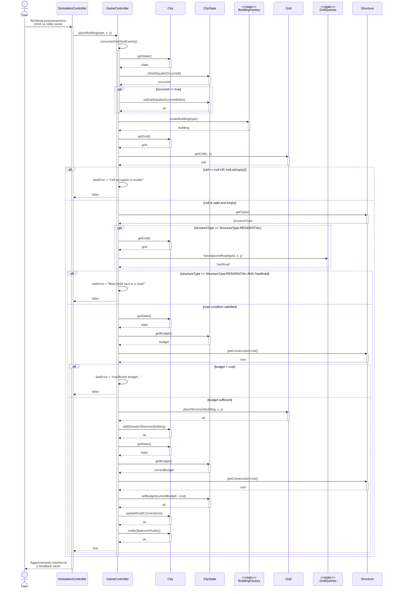

# Diagramma di Sequenza: Posizionamento Edificio (`placeBuilding`)

```mermaid
sequenceDiagram
    actor User
    participant UI as SimulationController
    participant GC as GameController
    participant City as City
    participant State as CityState
    participant Factory as <<static>><br/>BuildingFactory
    participant Grid as Grid
    participant Queries as <<static>><br/>GridQueries
    participant Structure as Structure

    User->>UI: Richiesta posizionamento<br/>(click su cella vuota)
    activate UI
    UI->>GC: placeBuilding(type, x, y)
    activate GC

    GC->>GC: consumeOneShotEvents()
    activate GC
    GC->>City: getState()
    activate City
    City-->>GC: state
    deactivate City
    GC->>State: isEarthquakeOccurred()
    activate State
    State-->>GC: occurred
    deactivate State

    opt occurred == true
        GC->>State: setEarthquakeOccurred(false)
        activate State
        State-->>GC: ok
        deactivate State
    end
    deactivate GC

    GC->>Factory: createBuilding(type)
    activate Factory
    Factory-->>GC: building
    deactivate Factory

    GC->>City: getGrid()
    activate City
    City-->>GC: grid
    deactivate City

    GC->>Grid: getCell(x, y)
    activate Grid
    Grid-->>GC: cell
    deactivate Grid

    alt cell == null OR !cell.isEmpty()
        GC->>GC: lastError = "Cell occupied or invalid."
        GC-->>UI: false
    else cell is valid and empty
        GC->>Structure: getType()
        activate Structure
        Structure-->>GC: structureType
        deactivate Structure

        opt structureType == StructureType.RESIDENTIAL
            GC->>City: getGrid()
            activate City
            City-->>GC: grid
            deactivate City

            GC->>Queries: hasAdjacentRoad(grid, x, y)
            activate Queries
            Queries-->>GC: hasRoad
            deactivate Queries
        end

        alt structureType == StructureType.RESIDENTIAL AND !hasRoad
            GC->>GC: lastError = "Must build next to a road!"
            GC-->>UI: false
        else road condition satisfied
            GC->>City: getState()
            activate City
            City-->>GC: state
            deactivate City

            GC->>State: getBudget()
            activate State
            State-->>GC: budget
            deactivate State

            GC->>Structure: getConstructionCost()
            activate Structure
            Structure-->>GC: cost
            deactivate Structure

            alt budget < cost
                GC->>GC: lastError = "Insufficient budget..."
                GC-->>UI: false
            else budget sufficient
                GC->>Grid: placeStructure(building, x, y)
                activate Grid
                Grid-->>GC: ok
                deactivate Grid

                GC->>City: addDisasterObserver(building)
                activate City
                City-->>GC: ok
                deactivate City

                GC->>City: getState()
                activate City
                City-->>GC: state
                deactivate City

                GC->>State: getBudget()
                activate State
                State-->>GC: currentBudget
                deactivate State

                GC->>Structure: getConstructionCost()
                activate Structure
                Structure-->>GC: cost
                deactivate Structure

                GC->>State: setBudget(currentBudget - cost)
                activate State
                State-->>GC: ok
                deactivate State

                GC->>City: updateRoadConnections()
                activate City
                City-->>GC: ok
                deactivate City

                GC->>City: notifyObserversPublic()
                activate City
                City-->>GC: ok
                deactivate City

                GC-->>UI: true
            end
        end
    end

    deactivate GC
    UI-->>User: Aggiornamento interfaccia<br/>e feedback visivo
    deactivate UI
```