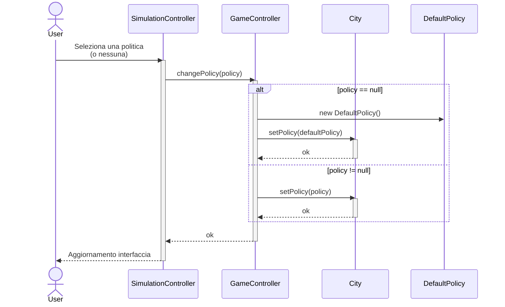

# Diagramma di Sequenza: Attivazione Policy (`changePolicy`)

```mermaid
sequenceDiagram
    actor User
    participant UI as SimulationController
    participant GC as GameController
    participant City as City
    participant DefaultPolicy as DefaultPolicy

    User->>UI: Seleziona una politica<br/>(o nessuna)
    activate UI
    UI->>GC: changePolicy(policy)
    activate GC

    alt policy == null
        GC->>DefaultPolicy: new DefaultPolicy()
        GC->>City: setPolicy(defaultPolicy)
        activate City
        City-->>GC: ok
        deactivate City
    else policy != null
        GC->>City: setPolicy(policy)
        activate City
        City-->>GC: ok
        deactivate City
    end

    GC-->>UI: ok
    deactivate GC
    UI-->>User: Aggiornamento interfaccia
    deactivate UI
```
