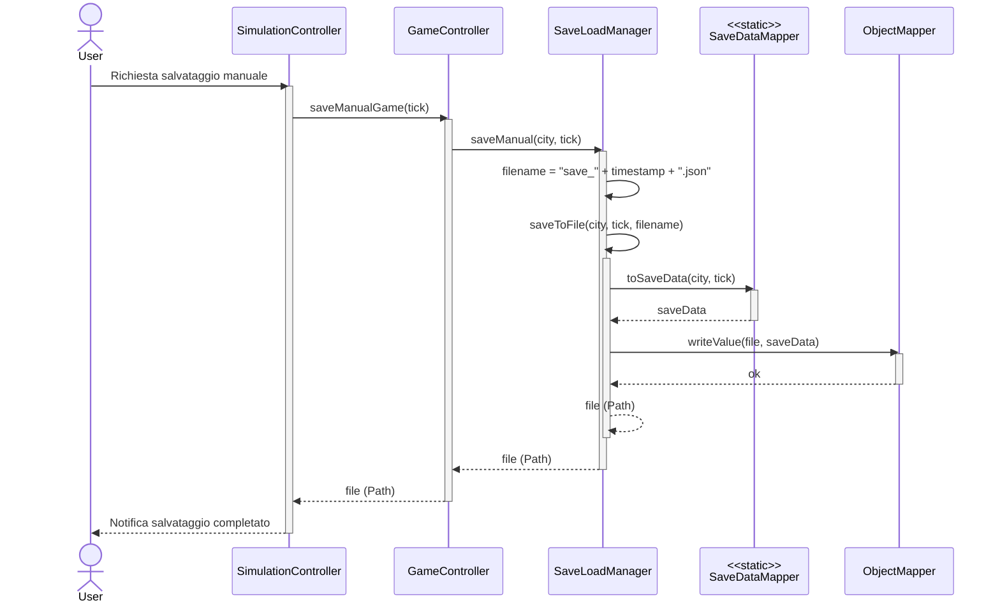

# Diagramma di Sequenza: Salvataggio Partita (`saveManualGame`)

```mermaid
sequenceDiagram
    actor User
    participant UI as SimulationController
    participant GC as GameController
    participant IO as SaveLoadManager
    participant Mapper as <<static>><br/>SaveDataMapper
    participant ObjMapper as ObjectMapper

    User->>UI: Richiesta salvataggio manuale
    activate UI
    UI->>GC: saveManualGame(tick)
    activate GC

    GC->>IO: saveManual(city, tick)
    activate IO

    IO->>IO: filename = "save_" + timestamp + ".json"

    IO->>IO: saveToFile(city, tick, filename)
    activate IO

    IO->>Mapper: toSaveData(city, tick)
    activate Mapper
    Mapper-->>IO: saveData
    deactivate Mapper

    IO->>ObjMapper: writeValue(file, saveData)
    activate ObjMapper
    ObjMapper-->>IO: ok
    deactivate ObjMapper

    IO-->>IO: file (Path)
    deactivate IO

    IO-->>GC: file (Path)
    deactivate IO

    GC-->>UI: file (Path)
    deactivate GC

    UI-->>User: Notifica salvataggio completato
    deactivate UI
```