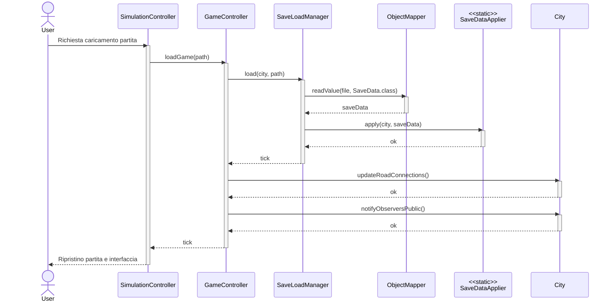

# Diagramma di Sequenza: Caricamento Partita (`loadGame`)

Questo documento illustra il diagramma di sequenza PlantUML relativo al caricamento e ripristino di una partita salvata in precedenza.

```mermaid
sequenceDiagram
    actor User
    participant UI as SimulationController
    participant GC as GameController
    participant IO as SaveLoadManager
    participant ObjMapper as ObjectMapper
    participant Applier as <<static>><br/>SaveDataApplier
    participant City as City

    User->>UI: Richiesta caricamento partita
    activate UI
    UI->>GC: loadGame(path)
    activate GC

    GC->>IO: load(city, path)
    activate IO

    IO->>ObjMapper: readValue(file, SaveData.class)
    activate ObjMapper
    ObjMapper-->>IO: saveData
    deactivate ObjMapper

    IO->>Applier: apply(city, saveData)
    activate Applier
    Applier-->>IO: ok
    deactivate Applier

    IO-->>GC: tick
    deactivate IO

    GC->>City: updateRoadConnections()
    activate City
    City-->>GC: ok
    deactivate City

    GC->>City: notifyObserversPublic()
    activate City
    City-->>GC: ok
    deactivate City

    GC-->>UI: tick
    deactivate GC

    UI-->>User: Ripristino partita e interfaccia
    deactivate UI
```
