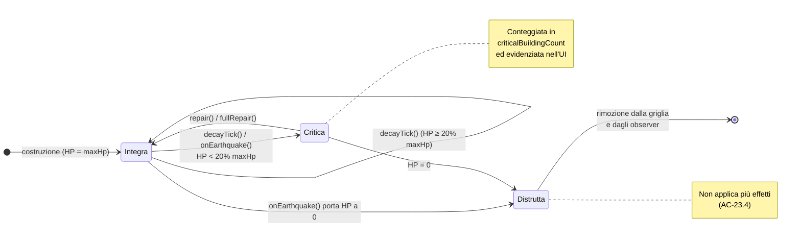
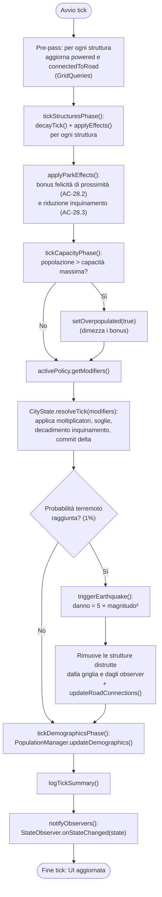

# State & Activity Diagram - City Simulator

Questo documento raccoglie due diagrammi comportamentali complementari ai diagrammi di sequenza:

1. un **diagramma di stato** che descrive il ciclo di vita di una `Structure` in funzione dei suoi HP;
2. un **diagramma di attività** che descrive il flusso interno di `advanceTick()`, ovvero il singolo
   passo di simulazione.

---

## 1. Diagramma di Stato — Ciclo di vita di una `Structure`

Ogni struttura nasce **Integra** (HP = maxHp). A ogni tick `decayTick()` ne riduce gli HP di 1
(le `Road` fanno eccezione: sovrascrivono `decayTick()` e non si deteriorano). Quando gli HP scendono
sotto il 20% di `maxHp` la struttura è segnalata come **Critica** (AC-23.2); quando raggiungono 0 è
**Distrutta** e viene rimossa dalla griglia. La riparazione (`repair()` / `fullRepair()`) riporta la
struttura allo stato Integra. Un terremoto (`onEarthquake()`) può ridurre bruscamente gli HP e far
transitare la struttura direttamente in stato Critica o Distrutta.

---

## 2. Diagramma di Attività — `advanceTick()`

Il diagramma descrive l'ordine delle fasi di un singolo tick, coerente con
[InternalSequenceDiagram1](InternalSequenceDiagram1.md). La **pre-pass** aggiorna i flag `powered` e
`connectedToRoad` di ogni struttura *prima* che `City.updateState()` li legga; l'ordine delle fasi
successive determina che i delta accumulati dagli edifici vengano risolti dalla politica attiva prima
dell'aggiornamento demografico e della notifica agli observer.

