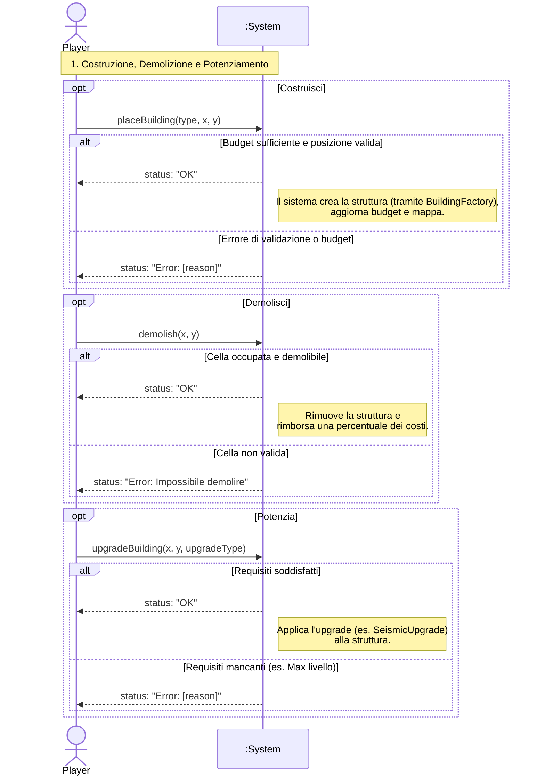
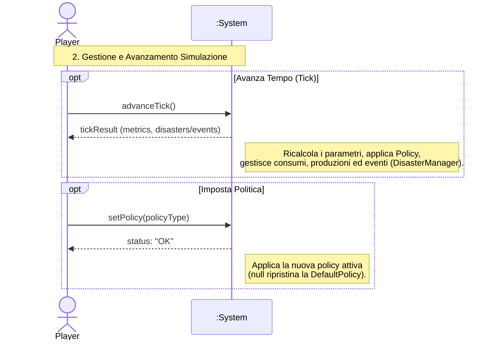
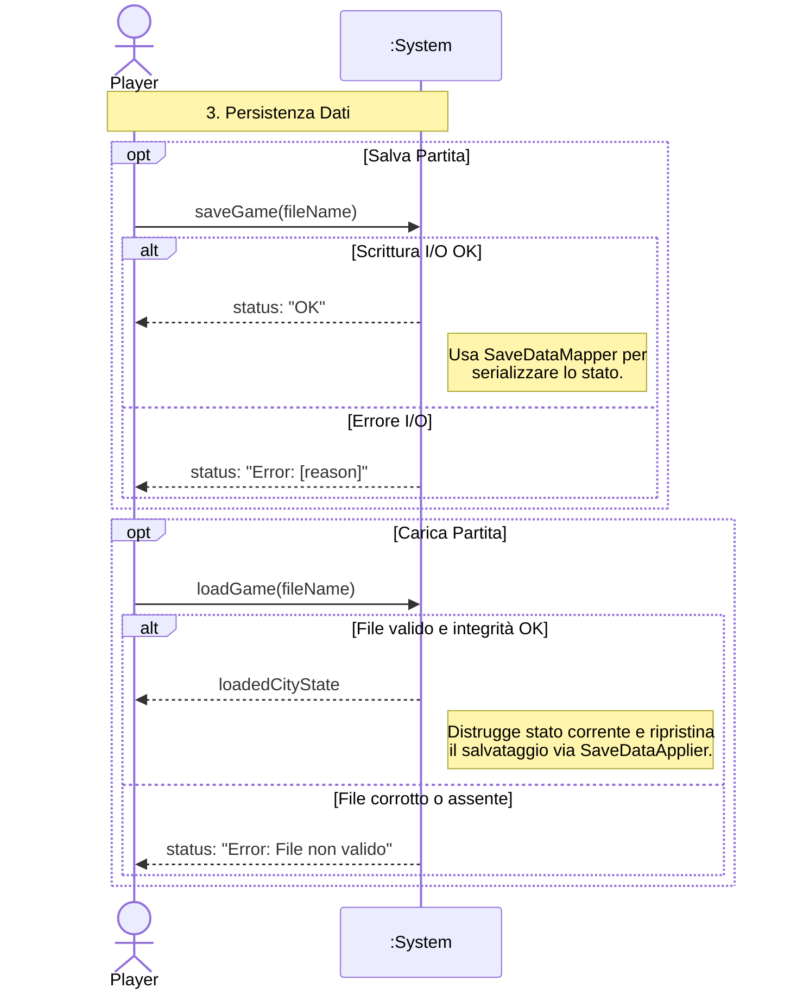

## 2. System Sequence Diagrams

I diagrammi seguenti mostra le interazioni tra l'attore esterno (Player) e il Sistema visto come scatola nera.

```mermaid
sequenceDiagram
    actor Player
    participant System as :System

    Note over Player, System: 1. Costruzione, Demolizione e Potenziamento

    opt Costruisci
        Player->>System: placeBuilding(type, x, y)
        alt Budget sufficiente e posizione valida
            System-->>Player: status: "OK"
            Note right of System: Il sistema crea la struttura (tramite BuildingFactory),<br/>aggiorna budget e mappa.
        else Errore di validazione o budget
            System-->>Player: status: "Error: [reason]"
        end
    end
    
    opt Demolisci
        Player->>System: demolish(x, y)
        alt Cella occupata e demolibile
            System-->>Player: status: "OK"
            Note right of System: Rimuove la struttura e<br/>rimborsa una percentuale dei costi.
        else Cella non valida
            System-->>Player: status: "Error: Impossibile demolire"
        end
    end
    
    opt Potenzia
        Player->>System: upgradeBuilding(x, y, upgradeType)
        alt Requisiti soddisfatti
            System-->>Player: status: "OK"
            Note right of System: Applica l'upgrade (es. SeismicUpgrade)<br/>alla struttura.
        else Requisiti mancanti (es. Max livello)
            System-->>Player: status: "Error: [reason]"
        end
    end
```

```mermaid
sequenceDiagram
    actor Player
    participant System as :System

    Note over Player, System: 2. Gestione e Avanzamento Simulazione

    opt Avanza Tempo (Tick)
        Player->>System: advanceTick()
        System-->>Player: tickResult (metrics, disasters/events)
        Note right of System: Ricalcola i parametri, applica Policy,<br/>gestisce consumi, produzioni ed eventi (DisasterManager).
    end
    
    opt Imposta Politica
        Player->>System: setPolicy(policyType)
        System-->>Player: status: "OK"
        Note right of System: Applica la nuova policy attiva<br/>(null ripristina la DefaultPolicy).
    end
```

```mermaid
sequenceDiagram
    actor Player
    participant System as :System

    Note over Player, System: 3. Persistenza Dati

    opt Salva Partita
        Player->>System: saveGame(fileName)
        alt Scrittura I/O OK
            System-->>Player: status: "OK"
            Note right of System: Usa SaveDataMapper per<br/>serializzare lo stato.
        else Errore I/O
            System-->>Player: status: "Error: [reason]"
        end
    end
    
    opt Carica Partita
        Player->>System: loadGame(fileName)
        alt File valido e integrità OK
            System-->>Player: loadedCityState
            Note right of System: Distrugge stato corrente e ripristina<br/>il salvataggio via SaveDataApplier.
        else File corrotto o assente
            System-->>Player: status: "Error: File non valido"
        end
    end
```
