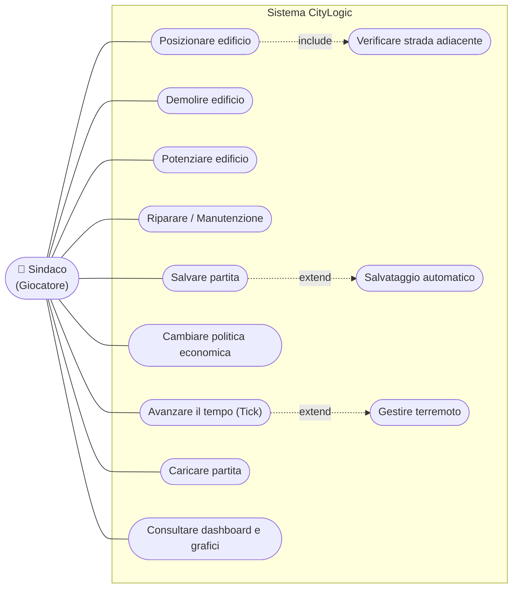

# Use Case Diagram - City Simulator

Il diagramma dei casi d'uso descrive le funzionalità del sistema **CityLogic** dal punto di vista
dell'utente. L'unico attore primario è il **Sindaco** (il giocatore), che gestisce la città
interagendo con il sistema. I terremoti non sono avviati dall'attore ma generati internamente dal
sistema a ogni tick: sono quindi modellati come evento di sistema collegato all'avanzamento del tempo.

Poiché Mermaid non dispone di un tipo nativo per i casi d'uso, il diagramma è reso con un `flowchart`
in cui l'attore è rappresentato a sinistra e i casi d'uso sono i nodi a forma ovale racchiusi nel
confine di sistema. Le relazioni `«include»` e `«extend»` sono indicate con archi tratteggiati.

## Descrizione dei casi d'uso

| Caso d'uso | Descrizione sintetica | Operazione di sistema |
|------------|-----------------------|-----------------------|
| Posizionare edificio | Il Sindaco costruisce una struttura su una cella libera pagandone il costo. | `placeBuilding(type, x, y)` |
| Verificare strada adiacente | Vincolo incluso nel posizionamento dei residenziali: serve una `Road` adiacente. | `GridQueries.hasAdjacentRoad()` |
| Demolire edificio | Rimuove una struttura applicando costo di demolizione e rimborso materiali. | `demolish(x, y)` |
| Potenziare edificio | Applica un upgrade (Decorator) a una struttura, fino a 3 livelli. | `upgradeBuilding(x, y, type)` |
| Riparare / Manutenzione | Riporta gli HP di una o tutte le strutture al massimo a fronte di un costo. | `repair(x, y)`, `repairAll()` |
| Avanzare il tempo (Tick) | Esegue un passo di simulazione aggiornando tutte le metriche. | `advanceTick()` |
| Gestire terremoto | Evento di sistema generato durante il tick con probabilità dell'1%. | `DisasterManager.triggerEarthquake()` |
| Cambiare politica economica | Seleziona la politica attiva tra Default, Green, Austerity, FossilFuel. | `changePolicy(policy)` |
| Salvare partita | Serializza lo stato corrente in un file JSON. | `saveManualGame(tick)` |
| Salvataggio automatico | Estensione opzionale del salvataggio, attivabile da UI ogni N tick. | `autosaveGame(tick)` |
| Caricare partita | Ripristina una partita da un file JSON. | `loadGame(path)` |
| Consultare dashboard e grafici | Visualizza metriche correnti e serie temporali aggiornate a ogni tick. | Pattern Observer (`StateObserver`) |

## Tracciabilità ai requisiti (storie SCRUM)

La tabella collega ogni caso d'uso alle storie utente gestite su Jira e ai relativi criteri di
accettazione verificati nel [System Test Report](../../SystemTestReport.md).

| Caso d'uso | Storia SCRUM | Criteri di accettazione |
|------------|--------------|--------------------------|
| Posizionare edificio | SCRUM-7 (Posizionamento + Factory) | AC-07.1 … AC-07.4 |
| Demolire edificio | SCRUM-21 (Demolizione) | AC-21.1 … AC-21.3 |
| Potenziare edificio | SCRUM-24 (Potenziamento + Decorator) | AC-24.1 … AC-24.5 |
| Riparare / Manutenzione | SCRUM-23 (Deterioramento + manutenzione) | AC-23.1 … AC-23.5 |
| Avanzare il tempo (Tick) | SCRUM-6 (Tick / Avanzamento temporale) | AC-06.1 … AC-06.3 |
| Gestire terremoto | SCRUM-11 (Terremoti + Observer) | AC-11.1 … AC-11.4 |
| Cambiare politica economica | SCRUM-15 (Politiche + Strategy), SCRUM-18 (Notifica cambio policy) | AC-15.1 … AC-15.3, AC-18.1 … AC-18.3 |
| Salvare / Caricare partita | SCRUM-8 (Salvataggio/caricamento JSON) | AC-08.1 … AC-08.5 |
| Consultare dashboard e grafici | SCRUM-10 (Dashboard con grafici JavaFX) | AC-10.1 … AC-10.2 |
